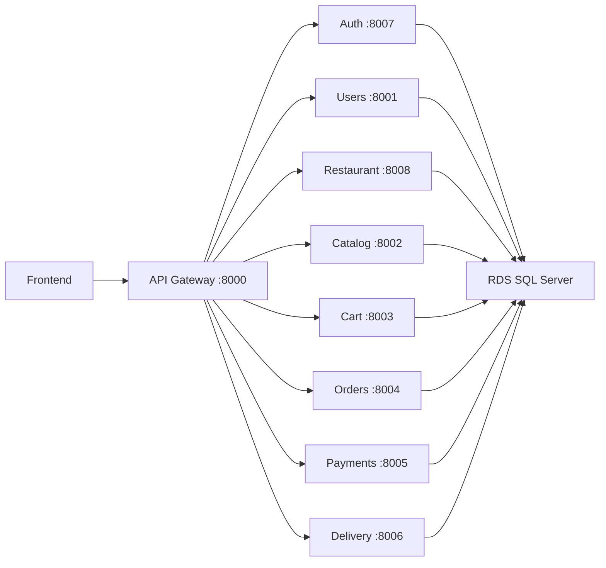

# Documentacion tecnica del backend

Fecha de validacion: 2026-06-15

## Resumen

El backend de GoHenryGo utiliza un API Gateway y ocho microservicios desplegados
con Docker Compose. Los servicios comparten una base Amazon RDS for SQL Server y
se comunican por HTTP interno.



## Servicios

| Servicio | Tecnologia | Puerto host | Responsabilidad |
| --- | --- | ---: | --- |
| API Gateway | FastAPI/Python 3.13 | 8000 | Entrada publica, proxy y SPA opcional |
| Users Service | FastAPI/Python 3.13 | 8001 | Usuarios, perfil, plataforma y repartidores |
| Catalog Service | Gin/Go 1.23 | 8002 | Productos, categorias, descuentos e imagenes |
| Cart Service | Gin/Go 1.23 | 8003 | Carritos persistidos y checkout legado |
| Orders Service | Spring Boot/Java 17 | 8004 | Pedidos, envio, estados y stock |
| Payments Service | Spring Boot/Java 17 | 8005 | Pagos y comisiones |
| Delivery Service | Spring Boot/Java 17 | 8006 | Asignaciones y entregas |
| Auth Service | FastAPI/Python 3.13 | 8007 | Registro, login y JWT |
| Restaurant Service | FastAPI/Python 3.13 | 8008 | Tiendas, horarios, logos y personal |

## Ejecucion

Crear `.env` desde `.env.example` y completar valores reales.

```powershell
docker compose up --build -d
docker compose ps
```

Health checks:

```powershell
Invoke-RestMethod http://localhost:8000/health
Invoke-RestMethod http://localhost:8001/health
Invoke-RestMethod http://localhost:8002/health
Invoke-RestMethod http://localhost:8003/health
Invoke-RestMethod http://localhost:8004/health
Invoke-RestMethod http://localhost:8005/health
Invoke-RestMethod http://localhost:8006/health
Invoke-RestMethod http://localhost:8007/health
Invoke-RestMethod http://localhost:8008/health
```

La inicializacion de base es separada y destructiva:

```powershell
docker compose --profile init run --rm database-init
```

Ese comando ejecuta `database/init_sqlserver.py --reset`. No debe formar parte
de un despliegue normal ni ejecutarse sobre datos que deban conservarse.

## Variables de entorno

### Base de datos

| Variable | Descripcion |
| --- | --- |
| `RDS_HOST` | Host de SQL Server en RDS |
| `RDS_PORT` | Puerto, normalmente `1433` |
| `RDS_DB` | Nombre de base |
| `RDS_USER` | Usuario SQL |
| `RDS_PASSWORD` | Contrasena SQL |

### Seguridad

| Variable | Descripcion |
| --- | --- |
| `JWT_SECRET` | Firma de JWT; usar valor aleatorio largo |
| `INTERNAL_SERVICE_TOKEN` | Autenticacion entre servicios |
| `INITIAL_ADMIN_EMAIL` | Admin creado por el inicializador |
| `INITIAL_ADMIN_PASSWORD` | Contrasena inicial |

### Descubrimiento de servicios

`AUTH_SERVICE_URL`, `USERS_SERVICE_URL`, `RESTAURANT_SERVICE_URL`,
`CATALOG_SERVICE_URL`, `CART_SERVICE_URL`, `ORDERS_SERVICE_URL`,
`PAYMENTS_SERVICE_URL` y `DELIVERY_SERVICE_URL` usan los nombres DNS de Docker
Compose.

Los secretos no se deben incluir en Git, logs, imagenes ni documentacion.

## API Gateway

Archivo:

```text
api-gateway/main.py
```

El gateway:

- Expone `GET /health`.
- Conserva metodo, query string, cuerpo y encabezados.
- Elimina el encabezado `Host` antes de reenviar.
- Usa un timeout de 30 segundos.
- Enruta rutas especiales antes de los prefijos generales.
- Puede servir el build React incluido en su imagen.

Enrutamiento:

| Ruta | Destino |
| --- | --- |
| `/api/v1/auth/*` | Auth |
| `/api/v1/admin-plataforma*` | Users |
| `/api/v1/usuarios*` | Users |
| `/api/v1/tiendas*` | Restaurant |
| `/api/v1/tiendas/{id}/productos` | Catalog |
| `/api/v1/productos*` | Catalog |
| `/api/v1/categorias*` | Catalog |
| `/api/v1/carritos*` | Cart |
| `/api/v1/pedidos*` | Orders |
| `/api/v1/pedidos/{id}/pago` | Payments |
| `/api/v1/estados-pedido*` | Orders |
| `/api/v1/ubicaciones*` | Orders |
| `/api/v1/pagos*` | Payments |
| `/api/v1/metodos-pago*` | Payments |
| `/api/v1/comisiones*` | Payments |
| `/api/v1/repartidores*` | Delivery |
| `/api/v1/asignaciones-repartidor*` | Delivery |

Las rutas `/internal/*` no se publican por el gateway.

## Autenticacion y autorizacion

El Auth Service emite JWT con ocho horas de vigencia. El token incluye el
identificador de usuario y correo. Los endpoints protegidos esperan:

```http
Authorization: Bearer <jwt>
```

Roles:

| Rol o relacion | Capacidades principales |
| --- | --- |
| `admin_plataforma` | Usuarios, tiendas, categorias y supervision global |
| Administrador de tienda | Tienda, personal, productos y pedidos propios |
| Empleado de tienda | Lectura/operacion de pedidos segun endpoint |
| Cliente | Cuenta, carrito, pedidos y pagos propios |
| Repartidor activo | Asignaciones disponibles y propias |

Las relaciones de tienda se guardan en `tienda_usuario`, con cargo
`administrador` o `empleado`.

Nota de seguridad: el estado actual usa SHA-256 sin salt para contrasenas. Para
produccion se recomienda migrar a Argon2id o bcrypt con rehash progresivo.

## Endpoints publicos

### Auth Service

| Metodo | Ruta | Uso |
| --- | --- | --- |
| `POST` | `/api/v1/auth/register` | Registrar y autenticar usuario |
| `POST` | `/api/v1/auth/login` | Autenticar y emitir JWT |
| `GET` | `/api/v1/auth/me` | Obtener usuario, rol y tiendas |

Registro:

```json
{
  "nombre": "Ana",
  "apellido": "Perez",
  "correo": "ana@example.com",
  "telefono": "0999999999",
  "password": "contrasena-segura",
  "acepta_repartos": false
}
```

El telefono debe tener 10 digitos y la contrasena al menos 8 caracteres.

### Users Service

| Metodo | Ruta | Uso |
| --- | --- | --- |
| `GET` | `/api/v1/usuarios` | Listar usuarios, plataforma |
| `POST` | `/api/v1/admin-plataforma` | Crear o promover administrador |
| `GET` | `/api/v1/usuarios/repartidores` | Listar repartidores |
| `GET` | `/api/v1/usuarios/buscar/correo/{correo}` | Buscar usuario |
| `GET` | `/api/v1/usuarios/{id}` | Consultar usuario permitido |
| `PATCH` | `/api/v1/usuarios/{id}` | Editar cuenta |
| `PATCH` | `/api/v1/usuarios/{id}/repartos` | Activar modo repartidor |

### Restaurant Service

| Metodo | Ruta | Uso |
| --- | --- | --- |
| `GET` | `/api/v1/tiendas` | Catalogo de tiendas y disponibilidad |
| `POST` | `/api/v1/tiendas` | Crear tienda |
| `PATCH` | `/api/v1/tiendas/{id}` | Editar tienda |
| `PATCH` | `/api/v1/tiendas/{id}/disponibilidad` | Abrir/cerrar manualmente |
| `DELETE` | `/api/v1/tiendas/{id}` | Eliminar tienda y datos dependientes |
| `GET` | `/api/v1/tiendas/{id}/personal` | Listar personal |
| `POST` | `/api/v1/tiendas/{id}/personal` | Agregar o reactivar personal |
| `DELETE` | `/api/v1/tiendas/{id}/personal/{membershipId}` | Desactivar personal |

Payload de tienda:

```json
{
  "nombre": "Cafeteria Central",
  "sucursal": "Campus UIDE",
  "logo_url": "https://cdn.example.com/logo.png",
  "nombre_lugar": "Edificio principal",
  "referencia": "Planta baja",
  "horario_apertura": "07:30",
  "horario_cierre": "18:00"
}
```

`logo_url` debe ser un enlace `http/https`. El cierre debe ser posterior a la
apertura.

Respuesta de disponibilidad:

```json
{
  "estado": true,
  "disponible": true,
  "cerrada_por_horario": false,
  "horario_apertura": "07:30",
  "horario_cierre": "18:00"
}
```

`estado` es el interruptor manual. `disponible` combina ese valor con la hora
actual en `America/Guayaquil`.

### Catalog Service

| Metodo | Ruta | Uso |
| --- | --- | --- |
| `GET` | `/api/v1/productos` | Catalogo publico activo |
| `GET` | `/api/v1/productos?tienda={id}` | Filtrar por tienda |
| `GET` | `/api/v1/productos?categoria={id_o_nombre}` | Filtrar por categoria |
| `GET` | `/api/v1/productos/{id}` | Obtener producto |
| `POST` | `/api/v1/productos` | Crear producto |
| `PATCH` | `/api/v1/productos/{id}` | Editar producto completo |
| `DELETE` | `/api/v1/productos/{id}` | Desactivar producto |
| `PATCH` | `/api/v1/productos/{id}/disponibilidad` | Alternar estado |
| `PATCH` | `/api/v1/productos/{id}/descuento` | Editar descuento |
| `GET` | `/api/v1/categorias` | Listar categorias |
| `POST` | `/api/v1/categorias` | Crear categoria |
| `GET` | `/api/v1/tiendas/{id}/productos` | Catalogo interno activo/inactivo |

Payload de producto:

```json
{
  "id_tienda": 7,
  "id_categorias": [2, 6],
  "nombre": "Gatorade",
  "descripcion": "Bebida hidratante",
  "precio": 1.1,
  "stock": 20,
  "descuento_porcentaje": 10,
  "descuento_inicio": "14:00",
  "descuento_fin": "19:00",
  "imagen_url": "https://cdn.example.com/gatorade.jpg",
  "estado": true
}
```

Reglas:

- Imagen opcional, solo `http/https`.
- Descuento entre 0 y 100.
- Con descuento mayor a cero, inicio y fin son obligatorios.
- Inicio debe ser menor que fin.
- La oferta se evalua diariamente en horario de Ecuador.

La respuesta agrega `descuento_activo`, `descuento_aplicado` y `precio_final`.
Las categorias se devuelven como objetos.

### Cart Service

| Metodo | Ruta | Uso |
| --- | --- | --- |
| `POST` | `/api/v1/carritos` | Crear carrito persistido |
| `GET` | `/api/v1/carritos/{id}` | Consultar carrito |
| `POST` | `/api/v1/carritos/{id}/items` | Agregar item |
| `PATCH` | `/api/v1/carritos/{id}/items/{itemId}` | Cambiar cantidad |
| `DELETE` | `/api/v1/carritos/{id}/items/{itemId}` | Eliminar item |
| `POST` | `/api/v1/carritos/{id}/checkout` | Convertir carrito en pedido |

La SPA actual mantiene su carrito en `localStorage` y crea el pedido
directamente. El servicio permanece disponible para integraciones y flujo
persistido.

### Orders Service

| Metodo | Ruta | Uso |
| --- | --- | --- |
| `GET` | `/api/v1/estados-pedido` | Catalogo de estados |
| `GET` | `/api/v1/ubicaciones?tipo=entrega` | Ubicaciones de entrega |
| `GET` | `/api/v1/pedidos?tienda={id}` | Pedidos de tienda |
| `GET` | `/api/v1/pedidos?usuario={id}` | Pedidos de cliente |
| `GET` | `/api/v1/pedidos/{id}` | Pedido, items y asignacion |
| `POST` | `/api/v1/pedidos/cotizar-envio` | Cotizar costo de envio |
| `POST` | `/api/v1/pedidos` | Crear pedido |
| `PATCH` | `/api/v1/pedidos/{id}/estado` | Cambiar estado |
| `PATCH` | `/api/v1/pedidos/{id}/cancelar` | Cancelacion por cliente |

Creacion:

```json
{
  "id_usuario": 10,
  "id_tienda": 7,
  "tipo_pedido": "delivery",
  "id_ubicacion_entrega": 5,
  "items": [
    {
      "id_producto": 3,
      "cantidad": 2
    }
  ]
}
```

#### Consistencia de stock

La creacion se ejecuta en una transaccion:

1. Valida que la tienda este habilitada y dentro del horario.
2. Agrupa cantidades repetidas por producto.
3. Bloquea productos con `UPDLOCK, ROWLOCK`.
4. Valida producto activo, tienda y stock.
5. Calcula el precio y descuento vigente.
6. Inserta pedido y detalle.
7. Descuenta stock con condicion `stock >= cantidad`.
8. Revierte toda la transaccion ante conflicto.

Si un pedido pendiente se cancela o rechaza, `restoreStock` devuelve las
unidades al inventario una sola vez.

Respuestas relevantes:

- `409` cuando la tienda esta cerrada o fuera de horario.
- `409` cuando no existe stock suficiente.
- `403` cuando el usuario no puede operar el pedido.

#### Costo de envio

| Trayecto | Costo |
| --- | ---: |
| Misma zona o ubicaciones generales | `$0.50` |
| Zona general hacia/desde Deportes o Automotriz/Gastronomia | `$1.00` |
| Deportes hacia/desde Automotriz/Gastronomia | `$1.50` |

### Payments Service

| Metodo | Ruta | Uso |
| --- | --- | --- |
| `GET` | `/api/v1/metodos-pago` | Metodos activos |
| `GET` | `/api/v1/pagos` | Listar pagos autorizados |
| `GET` | `/api/v1/pedidos/{id}/pago` | Pago del pedido |
| `POST` | `/api/v1/pedidos/{id}/pago` | Crear o reemplazar pago |
| `GET` | `/api/v1/comisiones` | Consultar comisiones |

### Delivery Service

| Metodo | Ruta | Uso |
| --- | --- | --- |
| `GET` | `/api/v1/repartidores/disponibles` | Repartidores activos |
| `GET` | `/api/v1/repartidores/{id}/asignaciones` | Asignaciones propias |
| `GET` | `/api/v1/asignaciones-repartidor` | Asignaciones disponibles/autorizadas |
| `POST` | `/api/v1/asignaciones-repartidor` | Crear asignacion pendiente |
| `PATCH` | `/api/v1/asignaciones-repartidor/{id}/aceptar` | Asignar repartidor |
| `PATCH` | `/api/v1/asignaciones-repartidor/{id}/en-camino` | Iniciar trayecto |
| `PATCH` | `/api/v1/asignaciones-repartidor/{id}/cancelar` | Cancelar asignacion |
| `PATCH` | `/api/v1/asignaciones-repartidor/{id}/entregar` | Completar entrega |

## Comunicacion interna

Los endpoints internos usan:

```http
X-Internal-Token: <INTERNAL_SERVICE_TOKEN>
```

Funciones principales:

- Resolver usuarios desde Auth, Restaurant o Users.
- Validar permisos de tienda.
- Obtener resumen de pedido para pagos o delivery.

No se deben exponer estas rutas en el gateway.

## Base de datos

Motor:

```text
Amazon RDS for SQL Server
```

El Security Group debe permitir TCP `1433` desde EC2 o desde el entorno local
que ejecute los contenedores.

Archivos:

| Archivo | Uso |
| --- | --- |
| `database/schema_sqlserver.sql` | Esquema, datos iniciales y vistas |
| `database/init_sqlserver.py` | Aplicacion destructiva del esquema |

Vistas principales:

| Vista | Uso |
| --- | --- |
| `V_Productos_Catalogo` | Productos publicos activos |
| `V_Productos_Catalogo_Tienda` | Productos internos activos/inactivos |
| `V_Actualizar_Estado_Pedido` | Lectura/actualizacion de estado |
| `V_Ordenes_Repartidor` | Asignaciones y entrega |
| `V_Ventas_Tiendas` | Ventas entregadas |
| `V_Comisiones_Repartidores` | Comisiones |
| `V_Usuarios_Permisos` | Resumen de permisos |

## Imagenes y almacenamiento

Los campos `logo_url` e `imagen_url` almacenan enlaces externos `http/https`.
El backend valida el formato, pero no descarga ni guarda los archivos.

No se usa:

- Amazon EFS.
- Volumen compartido de uploads.
- Subida multipart de imagenes.

## Despliegue actual

Backend:

```text
EC2 100.30.192.129
Docker Compose
API publica mediante ELB-GoHenry-680921418.us-east-1.elb.amazonaws.com
```

Procedimiento normal:

```bash
cd /home/ubuntu/GoHenry
git pull --ff-only origin main
sudo docker compose up -d --build
sudo docker compose ps
curl http://localhost:8000/health
```

No ejecutar el perfil `init` durante una actualizacion normal.

## Pruebas

```powershell
# Gateway
python -m pytest api-gateway

# Go
cd services/catalog-service
go test ./...

cd ../cart-service
go test ./...

# Java
cd services/orders-service
./mvnw test
```

Si Maven Wrapper no esta incluido, usar Maven instalado:

```powershell
mvn test
```

La verificacion de despliegue debe incluir:

- Todos los contenedores en estado `running`.
- `GET /health` del gateway.
- `GET /api/v1/tiendas` con `disponible`.
- Creacion de pedido con stock valido.
- Rechazo con stock insuficiente.
- Descuento de stock tras pedido.
- Restauracion de stock al cancelar un pedido pendiente.

## Diagnostico

| Sintoma | Revision |
| --- | --- |
| El codigo de EC2 es nuevo pero la API responde como antes | Reconstruir imagenes con `docker compose up -d --build` |
| Gateway sano pero una ruta falla | Revisar contenedor destino y URL interna |
| Error de conexion SQL | Revisar RDS, SG, variables y certificado |
| Tienda cerrada en horario valido | Revisar imagen de Restaurant Service y zona horaria |
| Stock no cambia | Revisar logs de Orders Service y transaccion |
| Frontend S3 no conecta | Revisar `VITE_API_URL`, ELB y CORS |

