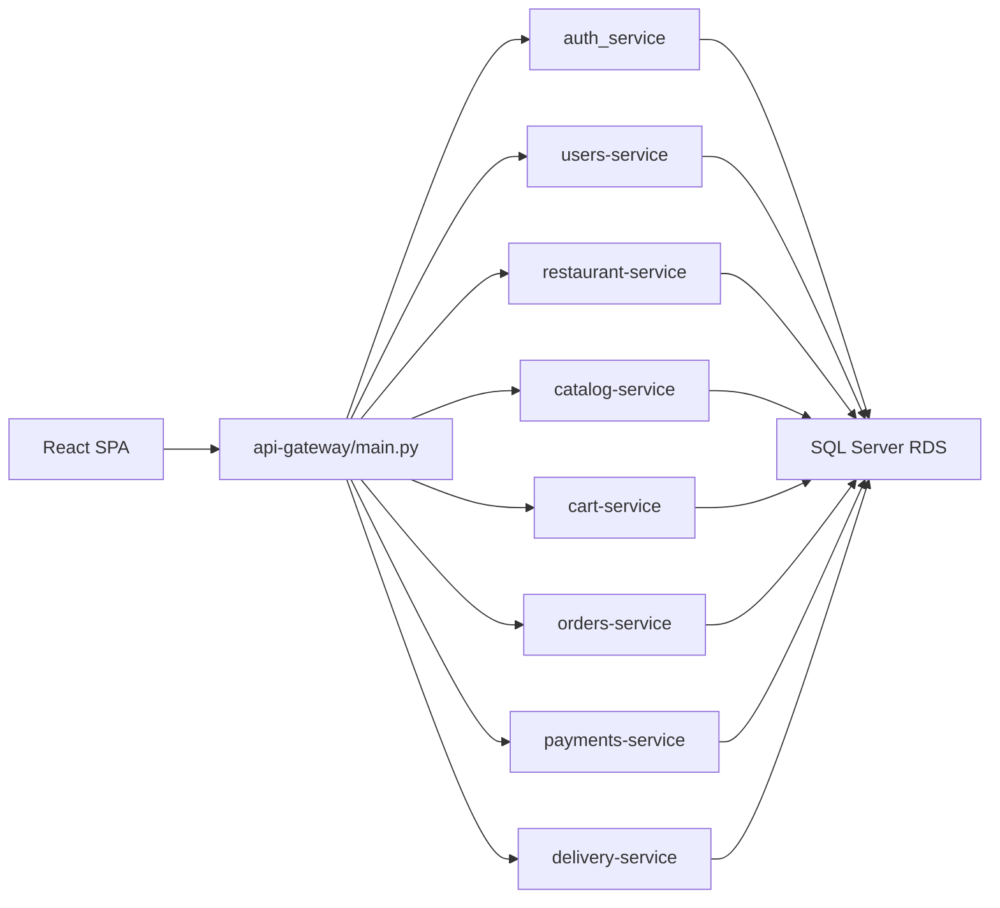
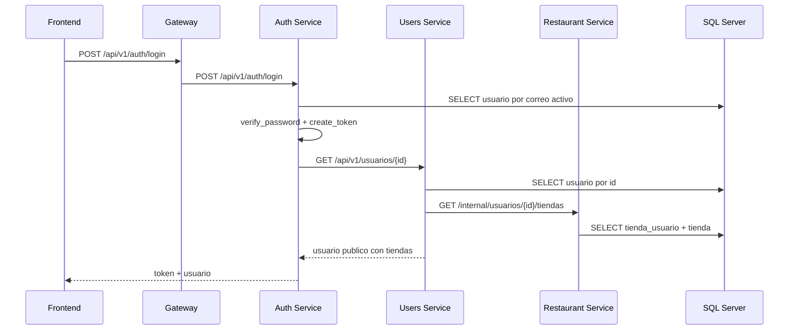
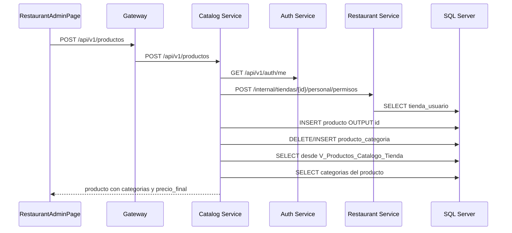
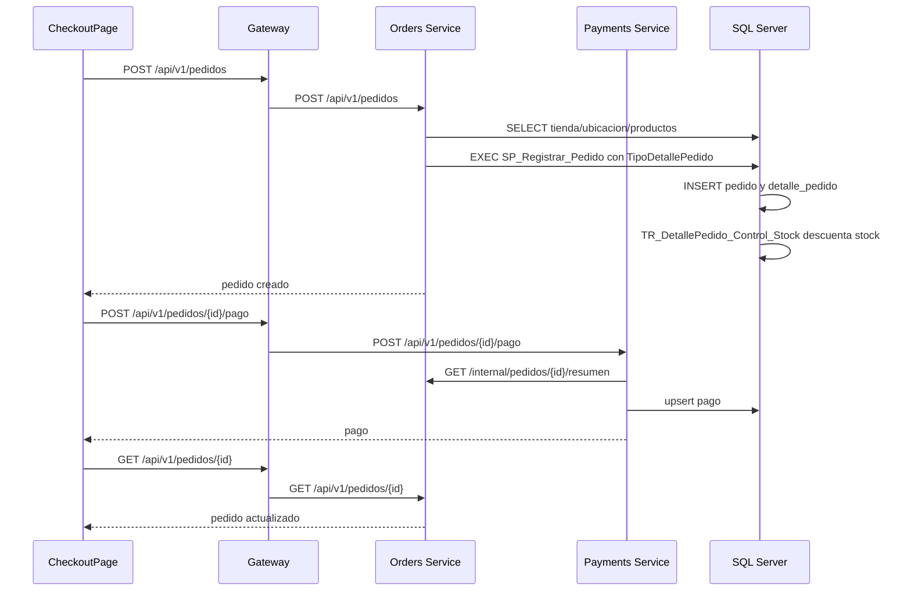
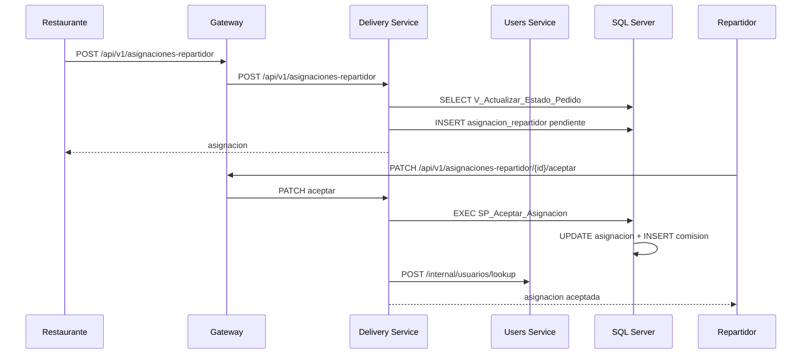

# Documentacion tecnica minuciosa

Fecha de validacion: 2026-06-16

Este documento explica el proyecto desde el codigo hacia afuera: que archivo
recibe cada peticion, que funcion ejecuta reglas de negocio, que consultas usa,
que tablas/vistas/procedimientos toca y que devuelve al frontend.

## Lectura rapida de la arquitectura



Regla general del backend:

- El gateway no tiene logica de negocio; solo decide a que servicio enviar cada ruta.
- Los servicios Python usan `routes.py -> services.py -> repositories.py`.
- Los servicios Go usan `main.go -> handlers (*.go) -> internal/db/queries.go`.
- Los servicios Java usan `Controller -> Service -> JdbcTemplate/Repository/Client`.
- La base SQL Server contiene tablas, vistas, triggers y procedimientos. Algunas reglas criticas, como stock y asignaciones concurrentes, se resuelven ahi.

## API Gateway

Archivo principal: `api-gateway/main.py`.

Responsabilidad:

- Exponer `GET /health`.
- Recibir todas las rutas publicas.
- Buscar el servicio destino con `target_for(path)`.
- Reenviar metodo, query string, body y headers.
- Quitar `Host`, porque ese header pertenece al gateway y no al servicio destino.
- Esperar hasta 30 segundos por la respuesta interna.
- Servir el build React desde `/app/frontend` si la imagen se construyo con frontend incluido.

Rutas especiales antes de prefijos generales:

| Condicion | Destino | Motivo |
| --- | --- | --- |
| `/api/v1/tiendas/{id}/productos` | Catalog Service | Aunque empieza por `/tiendas`, los productos pertenecen al catalogo |
| `/api/v1/pedidos/{id}/pago` | Payments Service | Aunque empieza por `/pedidos`, el pago pertenece a pagos |

Prefijos generales:

| Prefijo | Variable | Servicio |
| --- | --- | --- |
| `/api/v1/auth` | `AUTH_SERVICE_URL` | Auth |
| `/api/v1/admin-plataforma` | `USERS_SERVICE_URL` | Users |
| `/api/v1/usuarios` | `USERS_SERVICE_URL` | Users |
| `/api/v1/tiendas` | `RESTAURANT_SERVICE_URL` | Restaurant |
| `/api/v1/productos` | `CATALOG_SERVICE_URL` | Catalog |
| `/api/v1/categorias` | `CATALOG_SERVICE_URL` | Catalog |
| `/api/v1/carritos` | `CART_SERVICE_URL` | Cart |
| `/api/v1/pedidos` | `ORDERS_SERVICE_URL` | Orders |
| `/api/v1/estados-pedido` | `ORDERS_SERVICE_URL` | Orders |
| `/api/v1/ubicaciones` | `ORDERS_SERVICE_URL` | Orders |
| `/api/v1/pagos` | `PAYMENTS_SERVICE_URL` | Payments |
| `/api/v1/metodos-pago` | `PAYMENTS_SERVICE_URL` | Payments |
| `/api/v1/comisiones` | `PAYMENTS_SERVICE_URL` | Payments |
| `/api/v1/repartidores` | `DELIVERY_SERVICE_URL` | Delivery |
| `/api/v1/asignaciones-repartidor` | `DELIVERY_SERVICE_URL` | Delivery |

Si no hay destino:

- Si la ruta empieza por `/api`, devuelve `404` JSON.
- Si es `GET` y existe `/app/frontend`, intenta servir el archivo estatico o `index.html`.
- Si no aplica, devuelve `404`.

## Auth Service

Directorio: `services/auth_service`.

Proposito:

- Registrar usuarios.
- Iniciar sesion.
- Emitir JWT.
- Resolver el usuario actual desde un JWT.

Archivos principales:

| Archivo | Responsabilidad |
| --- | --- |
| `app/routes.py` | Define endpoints publicos de auth |
| `app/services.py` | Reglas de registro/login |
| `app/repositories.py` | Consulta `usuario` por correo o id |
| `app/security.py` | Hash SHA-256, verificacion de password, JWT y `current_user` |
| `app/user_client.py` | Llama a Users Service para crear o leer el perfil publico |
| `app/models.py` | Modelo SQLModel de `usuario` |
| `app/database.py` | Crea engine SQL Server desde variables RDS |

Endpoints:

| Endpoint | Funcion route | Funcion service | Repositorios/clientes |
| --- | --- | --- | --- |
| `POST /api/v1/auth/register` | `register` | `services.register` | `repositories.get_user_by_email`, `user_client.create_user_profile` |
| `POST /api/v1/auth/login` | `login` | `services.login` | `repositories.get_user_by_email`, `verify_password`, `user_client.get_public_user` |
| `GET /api/v1/auth/me` | `me` | `security.current_user` | `repositories.get_user_by_id`, `user_client.get_public_user` |

Flujo de registro:

1. `routes.register` recibe `RegisterRequest`.
2. `services.register` verifica si ya existe `correo` en la tabla `usuario`.
3. Si no existe, llama a Users Service:
   `POST {USERS_SERVICE_URL}/internal/usuarios`.
4. Users Service crea el usuario real en la base y devuelve campos publicos.
5. Auth genera JWT con `create_token(public)`.
6. Devuelve `{ token, usuario }`.

Consultas/repositorios usados:

| Funcion | Consulta logica |
| --- | --- |
| `get_user_by_email(session, correo, active_only)` | `SELECT usuario WHERE correo = ...`; si `active_only`, agrega `estado = true` |
| `get_user_by_id(session, id_usuario, active_only)` | `SELECT usuario WHERE id_usuario = ...`; si `active_only`, agrega `estado = true` |

Seguridad:

- `hash_password` usa `sha256:<digest>`.
- `verify_password` compara con `secrets.compare_digest`.
- `create_token` incluye `sub`, `correo` y expiracion de 8 horas.
- `current_user` exige `Authorization: Bearer <jwt>`, decodifica con `JWT_SECRET` y vuelve a leer el usuario activo.

Dependencias internas:

| Cliente | Ruta llamada | Header |
| --- | --- | --- |
| `create_user_profile` | `POST /internal/usuarios` en Users | `X-Internal-Token` |
| `get_public_user` | `GET /api/v1/usuarios/{id}` en Users | `Authorization` |

## Users Service

Directorio: `services/users-service`.

Proposito:

- Mantener usuarios.
- Crear usuarios desde Auth o Restaurant por ruta interna.
- Crear/promover admins de plataforma.
- Activar/desactivar modo repartidor.
- Devolver perfil publico con tiendas asociadas.

Archivos principales:

| Archivo | Responsabilidad |
| --- | --- |
| `app/routes.py` | Endpoints publicos e internos |
| `app/services.py` | Permisos y reglas de usuario |
| `app/repositories.py` | Operaciones SQLModel sobre `usuario` |
| `app/security.py` | JWT por Auth Service y token interno |
| `app/restaurant_client.py` | Lee membresias desde Restaurant Service |

Endpoints y flujo:

| Endpoint | Funcion service | Que hace |
| --- | --- | --- |
| `GET /api/v1/usuarios` | `list_users` | Solo admin plataforma; lista usuarios |
| `POST /internal/usuarios` | `create_or_get_internal_user` | Crea o reutiliza usuario por id/correo |
| `GET /internal/usuarios/repartidores` | `list_delivery_users` | Devuelve usuarios activos con `acepta_repartos = true` |
| `POST /internal/usuarios/lookup` | `lookup_internal_users` | Resuelve varios usuarios por ids |
| `GET /internal/usuarios/{id}` | `get_internal_user` | Devuelve usuario activo para servicios internos |
| `POST /api/v1/admin-plataforma` | `create_platform_admin` | Crea o promueve admin global |
| `GET /api/v1/usuarios/repartidores` | `list_delivery_users` | Lista repartidores activos |
| `GET /api/v1/usuarios/buscar/correo/{correo}` | `get_user_by_email` | Solo admin plataforma |
| `GET /api/v1/usuarios/{id}` | `get_user` | Propietario o admin plataforma |
| `PATCH /api/v1/usuarios/{id}/repartos` | `update_delivery_mode` | Propietario o admin plataforma |
| `PATCH /api/v1/usuarios/{id}` | `update_account` | Solo propietario |

Repositorio `app/repositories.py`:

| Funcion | Tabla | Operacion |
| --- | --- | --- |
| `list_users` | `usuario` | Lista todos, ordenados por `id_usuario` |
| `list_delivery_users` | `usuario` | Filtra `acepta_repartos = true` y `estado = true` |
| `list_users_by_ids` | `usuario` | Busca ids unicos activos |
| `get_user_by_id` | `usuario` | Busca por PK; opcionalmente activo |
| `get_user_by_email` | `usuario` | Busca por correo |
| `create_user` | `usuario` | Inserta nombre, correo, hash, rol, repartos y estado |
| `promote_to_platform_admin` | `usuario` | Cambia `rol_usuario` y reactiva |
| `update_delivery_mode` | `usuario` | Actualiza `acepta_repartos` |
| `update_account` | `usuario` | Actualiza nombre, apellido, telefono y password opcional |
| `public_fields` | `usuario` | Limpia la salida, sin `password_hash` |
| `public_user` | `usuario + tiendas` | Agrega `tiendas` al perfil |

Conexion con Restaurant Service:

- `public_user` llama a `restaurant_client.list_user_store_staff(id_usuario)`.
- Ese cliente invoca `GET /internal/usuarios/{id_usuario}/tiendas` con `X-Internal-Token`.
- Por eso `/api/v1/auth/me` termina devolviendo tambien las tiendas del usuario.

## Restaurant Service

Directorio: `services/restaurant-service`.

Proposito:

- Administrar tiendas.
- Administrar ubicacion de tienda, horario y logo.
- Abrir/cerrar tienda manualmente.
- Administrar personal por tienda.
- Resolver permisos internos para Catalog, Orders y Delivery.

Archivos principales:

| Archivo | Responsabilidad |
| --- | --- |
| `app/routes.py` | Endpoints de tiendas y personal |
| `app/services.py` | Permisos y reglas |
| `app/repositories.py` | SQLModel y SQL crudo para tiendas, ubicaciones y personal |
| `app/security.py` | Valida usuario actual contra Auth y roles de tienda |
| `app/user_client.py` | Resuelve usuarios contra Users Service |
| `app/schemas.py` | Validacion de payloads |

Endpoints publicos:

| Endpoint | Funcion service | Repositorios/clientes |
| --- | --- | --- |
| `GET /api/v1/tiendas` | `list_stores` | `repositories.list_stores` |
| `POST /api/v1/tiendas` | `create_store` | `require_platform_admin`, `repositories.create_store` |
| `PATCH /api/v1/tiendas/{id}` | `update_store` | `require_store_role`, `repositories.update_store` |
| `PATCH /api/v1/tiendas/{id}/disponibilidad` | `update_store_availability` | `repositories.update_store_availability` |
| `DELETE /api/v1/tiendas/{id}` | `delete_store` | `require_platform_admin`, `repositories.delete_store` |
| `GET /api/v1/tiendas/{id}/personal` | `list_store_staff` | `repositories.list_store_staff`, `user_client.lookup_users` |
| `POST /api/v1/tiendas/{id}/personal` | `add_store_staff` | `user_client.resolve_staff_user`, `repositories.upsert_store_staff` |
| `DELETE /api/v1/tiendas/{id}/personal/{membership}` | `remove_store_staff` | `repositories.remove_store_staff` |

Endpoints internos:

| Endpoint | Usado por | Que devuelve |
| --- | --- | --- |
| `POST /internal/tiendas/{id}/personal/permisos` | Catalog, Orders, Delivery | `{ "allowed": true/false }` |
| `GET /internal/usuarios/{id}/tiendas` | Users/Auth | Tiendas donde el usuario es personal activo |

Repositorio `app/repositories.py`:

| Funcion | Tablas | Que hace |
| --- | --- | --- |
| `list_stores` | `tienda`, `ubicacion` | Join para devolver tienda con lugar/referencia |
| `create_store` | `ubicacion`, `tienda` | Crea ubicacion tipo `tienda`, luego tienda activa |
| `get_store` | `tienda` | Busca por PK |
| `get_store_with_location` | `tienda`, `ubicacion` | Devuelve una tienda enriquecida |
| `update_store` | `tienda`, `ubicacion` | Actualiza datos, horario, logo y ubicacion |
| `update_store_availability` | `tienda` | Cambia `estado` manual |
| `delete_store` | varias | Borra comisiones, pagos, asignaciones, pedidos, carritos, productos, personal, tienda y ubicaciones huerfanas |
| `has_store_role` | `tienda_usuario` | Valida cargo activo por tienda |
| `list_store_staff` | `tienda_usuario` | Lista personal activo de tienda |
| `list_user_store_staff` | `tienda_usuario`, `tienda` | Tiendas de un usuario |
| `upsert_store_staff` | `tienda_usuario` | Reactiva o crea relacion usuario-tienda |
| `remove_store_staff` | `tienda_usuario` | Marca `estado = false`, no borra fisicamente |
| `store_with_location` | salida calculada | Agrega `disponible` y `cerrada_por_horario` |
| `store_is_within_schedule` | horario | Calcula hora actual en `America/Guayaquil` |

Validaciones de `TiendaRequest`:

- `nombre` y `nombre_lugar` no pueden estar vacios.
- `horario_apertura` y `horario_cierre` deben ser `HH:mm`.
- `horario_cierre` debe ser posterior a apertura.
- `logo_url`, si existe, debe ser `http` o `https`.

## Catalog Service

Directorio: `services/catalog-service`.

Proposito:

- Exponer productos publicos activos.
- Exponer productos internos de una tienda, activos e inactivos.
- Crear, editar, eliminar y pausar productos.
- Crear/listar categorias.
- Calcular descuentos activos y precio final.

Archivos principales:

| Archivo | Responsabilidad |
| --- | --- |
| `main.go` | Abre conexion SQL Server, configura Gin, CORS y rutas |
| `products.go` | Handlers de productos y mapeo de respuesta |
| `categories.go` | Handlers de categorias |
| `discounts.go` | Normalizacion y calculo de descuentos |
| `auth.go` | Usuario actual y permiso de tienda via Auth/Restaurant |
| `schemas.go` | Structs de request |
| `internal/db/queries.go` | Todas las queries SQL del servicio |
| `internal/db/models.go` | Structs de filas y parametros |

Rutas registradas en `main.go`:

| Ruta | Handler | Query principal |
| --- | --- | --- |
| `GET /api/v1/productos` | `listProducts` | `ListProducts` o `ListProductsByStore` |
| `POST /api/v1/productos` | `createProduct` | `CreateProduct`, `SetProductCategories`, `GetProduct` |
| `GET /api/v1/productos/:id` | `getProduct` | `GetProduct`, `ListProductCategories` |
| `PATCH /api/v1/productos/:id` | `updateProduct` | `ProductStore`, `GetProduct`, `UpdateProduct`, `SetProductCategories` |
| `DELETE /api/v1/productos/:id` | `deleteProduct` | `ProductStore`, `DeleteProduct` |
| `PATCH /api/v1/productos/:id/disponibilidad` | `updateAvailability` | `ProductStore`, `UpdateProductAvailability`, `GetProduct` |
| `PATCH /api/v1/productos/:id/descuento` | `updateDiscount` | `ProductStore`, `UpdateProductDiscount`, `GetProduct` |
| `GET /api/v1/categorias` | `listCategories` | `ListCategories` |
| `POST /api/v1/categorias` | `createCategory` | `CreateCategory` |
| `GET /api/v1/tiendas/:id/productos` | `listProductsByStore` | `ListProductsByStore` |

Detalle de `products.go`:

| Funcion | Que hace | Queries que usa |
| --- | --- | --- |
| `productMap(product)` | Convierte `ProductRow` a JSON, carga categorias, calcula descuento activo y `precio_final` | `ListProductCategories` |
| `productMaps(products, categoryFilter)` | Mapea lista completa y filtra por categoria si llega `?categoria=` | `productMap` |
| `matchesCategory` | Compara filtro por id o nombre de categoria | Ninguna |
| `listProducts` | Si llega `?tienda=`, lista por tienda; si no, lista catalogo publico activo | `ListProducts`, `ListProductsByStore` |
| `listProductsByStore` | Lista catalogo de una tienda para admin, activos e inactivos | `ListProductsByStore` |
| `getProduct` | Busca producto por id, devuelve 404 si no existe | `GetProduct`, `productMap` |
| `createProduct` | Valida JWT y rol administrador de tienda, normaliza descuento/imagen, inserta producto, asigna categorias y devuelve producto completo | `CreateProduct`, `SetProductCategories`, `GetProduct` |
| `updateProduct` | Busca tienda del producto, valida permiso, normaliza datos, actualiza producto y categorias | `ProductStore`, `GetProduct`, `UpdateProduct`, `SetProductCategories`, `getProduct` |
| `deleteProduct` | Valida permiso y borra producto si no tiene historial de pedidos | `ProductStore`, `DeleteProduct` |
| `updateAvailability` | Cambia `producto.estado` | `ProductStore`, `UpdateProductAvailability`, `getProduct` |
| `updateDiscount` | Cambia descuento y horario | `ProductStore`, `UpdateProductDiscount`, `getProduct` |
| `productStore` | Devuelve `id_tienda` del producto para validar permisos | `ProductStore` |
| `normalizeImageURL` | Acepta vacio, `http` o `https`; rechaza otros esquemas | Ninguna |

Queries de `internal/db/queries.go`:

| Funcion | SQL/tables/vistas | Resultado |
| --- | --- | --- |
| `ListProducts` | `SELECT ... FROM V_Productos_Catalogo ORDER BY id_producto` | Solo productos activos publicos |
| `ListProductsByStore(idTienda)` | `SELECT ... FROM V_Productos_Catalogo_Tienda WHERE id_tienda = @p1` | Productos activos e inactivos de una tienda |
| `GetProduct(idProducto)` | `SELECT ... FROM V_Productos_Catalogo_Tienda WHERE id_producto = @p1` | Un producto, incluso si esta inactivo |
| `CreateProduct(params)` | `INSERT INTO producto (...) OUTPUT INSERTED.id_producto` | Id creado |
| `UpdateProduct(params)` | `UPDATE producto SET nombre, descripcion, precio, stock, descuento, imagen_url, estado WHERE id_producto` | Actualiza producto |
| `UpdateProductAvailability(params)` | `UPDATE producto SET estado = @p1 WHERE id_producto = @p2` | Pausa/activa |
| `DeleteProduct(id)` | Transaccion: cuenta `detalle_pedido`, borra `detalle_carrito`, `producto_categoria`, `producto` | Borra solo si no tiene pedidos |
| `UpdateProductDiscount(params)` | `UPDATE producto SET descuento_porcentaje, descuento_inicio, descuento_fin` | Actualiza descuento |
| `ProductStore(id)` | `SELECT id_tienda FROM producto WHERE id_producto = @p1` | Tienda duena |
| `ListCategories` | `SELECT id_categoria, nombre, descripcion, estado FROM categoria ORDER BY nombre` | Categorias |
| `CreateCategory` | `INSERT INTO categoria (...) OUTPUT INSERTED.id_categoria` | Id creado |
| `ListProductCategories` | Join `categoria` + `producto_categoria` por producto | Categorias del producto |
| `SetProductCategories` | Transaccion: borra relaciones, valida categorias activas, inserta nuevas | Reemplaza categorias |

De donde salen los campos de un producto:

| Campo API | Fuente |
| --- | --- |
| `id_producto`, `id_tienda`, `nombre`, `descripcion`, `precio`, `stock`, `imagen_url`, `estado` | Vistas `V_Productos_Catalogo` o `V_Productos_Catalogo_Tienda` |
| `tienda_nombre` | `t.nombre` en vistas |
| `categorias_texto` | `STRING_AGG(c.nombre, ', ')` en vistas |
| `categorias` | `ListProductCategories` hace join contra `producto_categoria` |
| `descuento_activo` | `discountActive(...)` en Go usando hora actual |
| `descuento_aplicado` | Igual a porcentaje solo si descuento activo |
| `precio_final` | `precio * (1 - descuento/100)`, redondeado a 2 decimales |

Vistas SQL usadas:

- `V_Productos_Catalogo`: solo `p.estado = 1`, para cliente publico.
- `V_Productos_Catalogo_Tienda`: sin filtro de estado, para administracion.

## Cart Service

Directorio: `services/cart-service`.

Proposito:

- Mantener carrito persistido en base.
- Agregar, actualizar y borrar items.
- Convertir carrito a pedido llamando al Orders Service.

Nota: la SPA actual usa `localStorage` para el carrito principal, pero este servicio sigue disponible como flujo persistido.

Archivos principales:

| Archivo | Responsabilidad |
| --- | --- |
| `main.go` | Conexion SQL Server, Gin, CORS y rutas |
| `cart_handlers.go` | Handlers de carrito |
| `cart_mapper.go` | Convierte filas de carrito en JSON |
| `auth.go` | Usuario actual y permiso de carrito |
| `schemas.go` | Structs de request |
| `internal/db/queries.go` | SQL de carrito |

Rutas:

| Ruta | Handler | Queries/clientes |
| --- | --- | --- |
| `POST /api/v1/carritos` | `createCart` | `CreateCart`, `writeCart` |
| `GET /api/v1/carritos/:id` | `getCart` | `canUseCart`, `writeCart` |
| `POST /api/v1/carritos/:id/items` | `addItem` | `ProductPrice`, `AddCartItem`, `writeCart` |
| `PATCH /api/v1/carritos/:id/items/:itemId` | `updateItem` | `CartItemPrice`, `UpdateCartItem` o `DeleteCartItem` |
| `DELETE /api/v1/carritos/:id/items/:itemId` | `deleteItem` | `DeleteCartItem` |
| `POST /api/v1/carritos/:id/checkout` | `checkout` | `cartMap`, HTTP `POST /api/v1/pedidos`, `CheckoutCart` |

Queries de `internal/db/queries.go`:

| Funcion | SQL/tables | Resultado |
| --- | --- | --- |
| `CreateCart` | `INSERT INTO carrito (id_usuario, id_tienda, id_estado_carrito) OUTPUT INSERTED.id_carrito` | Carrito nuevo con estado 1 |
| `GetCart` | `SELECT ... FROM carrito WHERE id_carrito = @p1` | Cabecera de carrito |
| `ListCartItems` | Join `detalle_carrito` + `producto` | Items con nombre y subtotal |
| `ProductPrice` | `SELECT precio FROM producto WHERE id_producto = @p1` | Precio actual base |
| `AddCartItem` | `INSERT INTO detalle_carrito (...)` | Inserta item |
| `CartItemPrice` | `SELECT precio_unitario FROM detalle_carrito WHERE id_detalle_carrito = @p1` | Precio ya guardado |
| `UpdateCartItem` | `UPDATE detalle_carrito SET cantidad, subtotal` | Cambia cantidad |
| `DeleteCartItem` | `DELETE FROM detalle_carrito WHERE id_detalle_carrito = @p1` | Borra item |
| `CheckoutCart` | `UPDATE carrito SET id_estado_carrito = 2, fecha_actualizacion = CURRENT_TIMESTAMP` | Marca carrito cerrado |
| `CartOwner` | `SELECT id_usuario FROM carrito WHERE id_carrito = @p1` | Permiso de propietario |

`cart_mapper.go`:

- `writeCart` responde `cartMap`.
- `cartMap` lee cabecera con `GetCart`, items con `ListCartItems`, suma subtotales y arma:
  `id_carrito`, `id_usuario`, `id_tienda`, `id_estado_carrito`, fechas, `items`, `total`.

Checkout persistido:

1. Valida permiso sobre carrito.
2. Lee el carrito con `cartMap`.
3. Arma payload compatible con Orders:
   `id_usuario`, `id_tienda`, `tipo_pedido`, ubicacion y `items`.
4. Llama a `ORDERS_SERVICE_URL/api/v1/pedidos` reenviando `Authorization`.
5. Marca el carrito con `CheckoutCart`.
6. Devuelve la respuesta de Orders.

## Orders Service

Directorio: `services/orders-service`.

Proposito:

- Crear pedidos.
- Listar pedidos de cliente o tienda.
- Cotizar envio.
- Cambiar estados de pedido.
- Validar stock y disponibilidad en conjunto con SQL Server.

Archivos principales:

| Archivo | Responsabilidad |
| --- | --- |
| `OrderController.java` | Endpoints |
| `OrderService.java` | Reglas de negocio y SQL con `JdbcTemplate` |
| `DeliveryFeeCalculator.java` | Costo de envio por zona |
| `AuthService.java` | Usuario actual via Auth, permisos via Restaurant |
| `RestaurantClient.java` | Consulta permisos de tienda |
| `UserClient.java` | Enriquece pedidos con datos de usuarios |
| `ApiExceptionHandler.java` | Manejo de excepciones |
| `application.properties` | Datasource SQL Server y puerto |

Endpoints:

| Endpoint | Controller | Service |
| --- | --- | --- |
| `GET /api/v1/estados-pedido` | `estados` | `estados` |
| `GET /api/v1/ubicaciones?tipo=entrega` | `ubicaciones` | `ubicaciones` |
| `GET /api/v1/pedidos?tienda=&usuario=` | `pedidos` | `pedidos` |
| `GET /api/v1/pedidos/{id}` | `pedidoEndpoint` | `pedidoEndpoint` |
| `GET /internal/pedidos/{id}/resumen` | `pedidoResumen` | `pedidoResumen` |
| `POST /api/v1/pedidos` | `crearPedido` | `crearPedido` |
| `POST /api/v1/pedidos/cotizar-envio` | `cotizarEnvio` | `cotizarEnvio` |
| `PATCH /api/v1/pedidos/{id}/estado` | `actualizarEstado` | `actualizarEstado` |
| `PATCH /api/v1/pedidos/{id}/cancelar` | `cancelarPedido` | `cancelarPedido` |

Consultas y metodos importantes:

| Metodo | SQL/tables/vistas | Que hace |
| --- | --- | --- |
| `estados` | `SELECT * FROM estado_pedido ORDER BY id_estado_pedido` | Catalogo de estados |
| `ubicaciones(tipo)` | `SELECT ... FROM ubicacion WHERE tipo_ubicacion = ? AND estado = 1` | Ubicaciones activas |
| `basePedidoSql` | `pedido`, `estado_pedido`, `tienda`, `ubicacion` | Query base de pedido |
| `pedidos(tienda, usuario, user)` | `basePedidoSql WHERE ...` | Lista pedidos segun filtro y permiso |
| `pedido(id)` | `basePedidoSql WHERE p.id_pedido = ?` | Pedido individual |
| `items(idPedido)` | Join `detalle_pedido` + `producto` | Productos del pedido |
| `pedidoResumen` | `SELECT id_pedido, id_usuario, id_tienda, subtotal, total_descuento, costo_envio, total, total_con_envio FROM pedido` | Resumen para Payments |
| `resolverUbicacionEntrega` | `tienda`, `ubicacion` | Usa ubicacion de tienda para pickup, valida/crea entrega para delivery |
| `ubicacionesParaEnvio` | Join tienda/origen + ubicacion/destino | Datos para calcular tarifa |
| `validarTiendaDisponible` | `SELECT estado, horario_apertura, horario_cierre FROM tienda` | Valida apertura manual y horario Ecuador |
| `registrarPedidoConProcedimiento` | `EXEC dbo.SP_Registrar_Pedido` | Crea pedido y detalle via TVP |
| `actualizarEstado` | `pedido WITH (UPDLOCK, ROWLOCK)`, `estado_pedido` | Cambia estado con transiciones permitidas |
| `cancelarPedido` | `UPDATE pedido ... WHERE estado = pendiente` | Cliente cancela solo antes de aceptacion |
| `restaurarStock` | `UPDATE producto JOIN detalle_pedido` | Devuelve stock si se rechaza/cancela |

Flujo de creacion de pedido:

1. `OrderController.crearPedido` recibe body y `Authorization`.
2. `AuthService.currentUser` consulta Auth Service `/api/v1/auth/me`.
3. `OrderService.crearPedido` valida que el `id_usuario` sea el actual o admin.
4. Valida `tipo_pedido` como `delivery` o `pickup`.
5. `validarTiendaDisponible` revisa `tienda.estado` y horario `America/Guayaquil`.
6. `resolverUbicacionEntrega`:
   - Pickup: usa ubicacion de la tienda.
   - Delivery existente: valida ubicacion tipo `entrega`.
   - Delivery nuevo: inserta `ubicacion`.
7. `normalizeRequestedQuantities` agrupa productos repetidos y valida cantidad > 0.
8. Si es delivery, calcula tarifa con `DeliveryFeeCalculator`.
9. `registrarPedidoConProcedimiento` envia un TVP SQL Server `dbo.TipoDetallePedido` al SP.
10. SQL Server crea `pedido` y `detalle_pedido`.
11. El trigger `TR_DetallePedido_Control_Stock` descuenta stock y bloquea stock insuficiente.
12. El servicio devuelve `pedido(idPedido)` enriquecido con items y usuario.

Stock en base de datos:

- `SP_Registrar_Pedido` inserta cabecera en `pedido` y lineas en `detalle_pedido`.
- `TR_DetallePedido_Control_Stock` se dispara al insertar/actualizar/borrar `detalle_pedido`.
- Si la cantidad neta supera `producto.stock`, lanza `52001 Stock insuficiente`.
- Si hay stock, actualiza `producto.stock = producto.stock - cantidad_neta`.
- `TR_Producto_Auditoria_Stock` registra cambios en `auditoria_stock`.
- Cuando un pedido pendiente se cancela o rechaza, Java llama `restaurarStock`, que suma las cantidades nuevamente.

Transiciones de estado:

| Estado actual | Nuevo estado permitido |
| --- | --- |
| `pendiente` | `aceptado`, `en_preparacion`, `rechazado` |
| `en_preparacion` | `listo_para_entrega` |
| `listo_para_entrega` con `pickup` | `entregado` |

Delivery puede cambiar a `en_camino` y `entregado` desde Delivery Service usando la vista `V_Actualizar_Estado_Pedido`.

## Payments Service

Directorio: `services/payments-service`.

Proposito:

- Listar metodos de pago.
- Crear o reemplazar pago de un pedido.
- Consultar pagos.
- Consultar comisiones.

Archivos principales:

| Archivo | Responsabilidad |
| --- | --- |
| `PaymentController.java` | Endpoints |
| `PaymentService.java` | Permisos y reglas de pago |
| `PaymentRepository.java` | Queries SQL |
| `OrderClient.java` | Consulta resumen de pedido a Orders |
| `AuthService.java` | Usuario actual y admin plataforma |

Endpoints:

| Endpoint | Service | Repositorio/cliente |
| --- | --- | --- |
| `GET /api/v1/metodos-pago` | `metodos` | `PaymentRepository.metodosActivos` |
| `GET /api/v1/pagos` | `pagos` | Admin plataforma, `PaymentRepository.pagos` |
| `GET /api/v1/pedidos/{id}/pago` | `pagoPorPedido` | Propietario/admin, `PaymentRepository.pagoPorPedido` |
| `POST /api/v1/pedidos/{id}/pago` | `crearPago` | Propietario/admin, `OrderClient.orderSummary`, `guardarPago` |
| `GET /api/v1/comisiones` | `comisiones` | Admin plataforma, `PaymentRepository.comisiones` |

Queries de `PaymentRepository`:

| Funcion | SQL |
| --- | --- |
| `metodosActivos` | `SELECT * FROM metodo_pago WHERE estado = 1 ORDER BY id_metodo_pago` |
| `pagos` | Join `pago` + `metodo_pago`, orden descendente |
| `pagoPorPedido` | Join `pago` + `metodo_pago WHERE id_pedido = ?` |
| `metodoPagoActivo` | `SELECT 1 FROM metodo_pago WHERE id_metodo_pago = ? AND estado = 1` |
| `guardarPago` | `UPDATE pago ... WHERE id_pedido = ?; IF @@ROWCOUNT = 0 INSERT INTO pago ...` |
| `comisiones` | `SELECT * FROM comision ORDER BY id_comision DESC` |

Flujo de crear pago:

1. Valida usuario con Auth Service.
2. `requireOrderOwnerOrAdmin` consulta Orders `/internal/pedidos/{id}/resumen`.
3. Valida propietario o admin plataforma.
4. Valida `estado_pago` en `pendiente`, `pagado`, `rechazado`.
5. Valida metodo activo.
6. Si `monto_total` llega en 0, usa `total_con_envio` del pedido.
7. Hace upsert en `pago`.
8. Devuelve pago enriquecido con nombre de metodo.

Nota: el esquema tambien incluye `SP_Registrar_Pago`, pero el servicio actual usa `PaymentRepository.guardarPago` con upsert SQL directo.

## Delivery Service

Directorio: `services/delivery-service`.

Proposito:

- Mostrar asignaciones pendientes y propias.
- Permitir aceptar una entrega.
- Marcar entrega en camino.
- Cancelar entrega.
- Marcar entrega entregada.
- Crear comision al aceptar.

Archivos principales:

| Archivo | Responsabilidad |
| --- | --- |
| `DeliveryController.java` | Endpoints |
| `DeliveryService.java` | Reglas de asignacion y SQL |
| `AuthService.java` | Usuario actual y permisos |
| `UserClient.java` | Busca repartidores y usuarios |
| `RestaurantClient.java` | Valida roles de tienda |

Endpoints:

| Endpoint | Service | SQL/cliente |
| --- | --- | --- |
| `GET /api/v1/repartidores/disponibles` | `disponibles` | Admin, `UserClient.deliveryUsers` |
| `GET /api/v1/repartidores/{id}/asignaciones` | `asignacionesPorRepartidor` | `V_Ordenes_Repartidor` |
| `GET /api/v1/asignaciones-repartidor?pedido=` | `asignaciones` | `V_Ordenes_Repartidor` |
| `POST /api/v1/asignaciones-repartidor` | `crearAsignacion` | `V_Actualizar_Estado_Pedido`, `asignacion_repartidor` |
| `PATCH /api/v1/asignaciones-repartidor/{id}/aceptar` | `aceptar` | `EXEC dbo.SP_Aceptar_Asignacion` |
| `PATCH /api/v1/asignaciones-repartidor/{id}/en-camino` | `enCamino` | `asignacion_repartidor`, `V_Actualizar_Estado_Pedido` |
| `PATCH /api/v1/asignaciones-repartidor/{id}/cancelar` | `cancelar` | `asignacion_repartidor`, `comision` |
| `PATCH /api/v1/asignaciones-repartidor/{id}/entregar` | `entregar` | `asignacion_repartidor`, `comision`, `V_Actualizar_Estado_Pedido` |

Metodos SQL importantes:

| Metodo | SQL/tables/vistas | Que hace |
| --- | --- | --- |
| `baseSql` | `SELECT ... FROM V_Ordenes_Repartidor` | Base de asignaciones |
| `assignments` | `jdbc.queryForList(baseSql...)` | Lista y enriquece usuarios |
| `crearAsignacion` | `V_Actualizar_Estado_Pedido` | Valida tienda, tipo delivery y estado listo |
| `crearAsignacion` | `asignacion_repartidor` | Inserta asignacion pendiente si no existe activa |
| `aceptar` | `EXEC dbo.SP_Aceptar_Asignacion` | Reclama entrega con control concurrente |
| `enCamino` | `UPDATE asignacion_repartidor ... estado='en_camino'` | Solo si estaba aceptada |
| `actualizarPedido` | `UPDATE V_Actualizar_Estado_Pedido SET id_estado_pedido = ?` | Cambia estado del pedido via trigger INSTEAD OF |
| `cancelar` | `UPDATE asignacion_repartidor`, `UPDATE comision` | Cancela entrega y comision |
| `entregar` | `UPDATE asignacion_repartidor`, `UPDATE comision` | Marca entrega y comision pagada |

`SP_Aceptar_Asignacion` en SQL Server:

1. Valida que el usuario exista, este activo y tenga `acepta_repartos = 1`.
2. Usa `UPDLOCK, HOLDLOCK` para impedir que un repartidor tenga mas de una entrega activa.
3. Actualiza una asignacion pendiente con `id_usuario = null`.
4. Si otro repartidor ya la tomo, devuelve `aceptada = 0`.
5. Inserta comision pendiente por el costo de envio si no existe.
6. Devuelve la fila desde `V_Ordenes_Repartidor`.

## Base de datos SQL Server

Archivo: `database/schema_sqlserver.sql`.

Tablas principales:

| Tabla | Proposito |
| --- | --- |
| `ubicacion` | Lugares de tienda y entrega |
| `usuario` | Cuentas, rol global y modo repartidor |
| `tienda` | Restaurantes, logo, horario y estado manual |
| `tienda_usuario` | Personal por tienda y cargo |
| `categoria` | Categorias de productos |
| `producto` | Productos, stock, imagen y descuento |
| `producto_categoria` | Relacion N:N producto-categoria |
| `carrito` | Carritos persistidos |
| `detalle_carrito` | Items del carrito persistido |
| `estado_pedido` | Catalogo de estados |
| `pedido` | Cabecera de pedido |
| `detalle_pedido` | Items confirmados |
| `asignacion_repartidor` | Delivery de pedidos |
| `metodo_pago` | Catalogo de metodos |
| `pago` | Pagos por pedido |
| `comision` | Ganancia de repartidor |
| `auditoria_stock` | Historial de cambios de stock |

Vistas:

| Vista | Usada por | Proposito |
| --- | --- | --- |
| `V_Productos_Catalogo` | Catalog publico | Productos activos |
| `V_Productos_Catalogo_Tienda` | Catalog admin | Productos activos e inactivos |
| `V_Ordenes_Repartidor` | Delivery | Asignaciones enriquecidas con pedido, tienda, cliente y comision |
| `V_Actualizar_Estado_Pedido` | Delivery | Vista actualizable para cambiar estado de pedido |
| `V_Ventas_Tiendas` | Reporteria potencial | Ventas entregadas por tienda |
| `V_Comisiones_Repartidores` | Reporteria potencial | Comisiones por repartidor |
| `V_Usuarios_Permisos` | Reporteria potencial | Usuarios con permisos |

Triggers:

| Trigger | Tabla/vista | Proposito |
| --- | --- | --- |
| `TR_V_Actualizar_Estado_Pedido_Update` | `V_Actualizar_Estado_Pedido` | Traduce update de la vista a update real en `pedido` |
| `TR_Producto_Auditoria_Stock` | `producto` | Audita cambios de stock |
| `TR_DetallePedido_Control_Stock` | `detalle_pedido` | Descuenta/devuelve stock y rechaza stock insuficiente |

Procedimientos/tipos:

| Objeto | Usado por | Proposito |
| --- | --- | --- |
| `TipoDetallePedido` | Orders | TVP con `id_producto`, `cantidad` |
| `SP_Registrar_Pedido` | Orders | Valida datos, calcula descuentos y crea pedido/detalle |
| `SP_Aceptar_Asignacion` | Delivery | Reclama asignacion y crea comision con control concurrente |
| `SP_Registrar_Pago` | No usado por el servicio actual | Registro de pago transaccional alternativo |

## Frontend

Directorio: `frontend`.

Stack:

- React 19.
- TypeScript.
- React Router 7.
- Vite 7.
- Tailwind CSS.
- Lucide React para iconos.

### Entrada de la aplicacion

| Archivo | Que hace |
| --- | --- |
| `src/main.tsx` | Monta React en `#root`, envuelve con `BrowserRouter` y `AppProvider`, importa PWA y CSS |
| `src/App.tsx` | Define rutas y `ProtectedRoute` |
| `src/api.ts` | Cliente HTTP unico |
| `src/context/AppContext.tsx` | Estado global y operaciones contra API |
| `src/styles.css` | Estilos globales y utilidades |

### Cliente HTTP `src/api.ts`

Fuente de URL:

```ts
const API_URL = (import.meta.env.VITE_API_URL || window.location.origin).replace(/\/$/, '');
```

Comportamiento:

- Agrega `Content-Type: application/json` si el body no es `FormData`.
- Lee `token` de `localStorage`.
- Si hay token, agrega `Authorization: Bearer <token>`.
- Si falla la red, lanza mensaje amigable.
- Si HTTP no es OK, intenta leer `detail` del JSON.
- Exporta `api.get`, `api.post`, `api.patch`, `api.delete`.
- `productImageUrl` y `storeLogoUrl` aceptan solo URLs que empiezan con `http`.

### Rutas de `App.tsx`

| Ruta | Pagina | Requisito |
| --- | --- | --- |
| `/`, `/index` | `HomePage` | Publico |
| `/restaurant/:id`, `/restaurante/:id` | `RestaurantPage` | Publico |
| `/detalle/:restaurantId/:productId` | `DetailPage` | Publico |
| `/login` | `LoginPage` | Publico |
| `/register` | `RegisterPage` | Publico |
| `/checkout`, `/carrito` | `CheckoutPage` | Usuario autenticado |
| `/pedido` | `OrderPage` | Usuario autenticado |
| `/usuario` | `UserPage` | Usuario autenticado |
| `/platform-admin` | `PlatformAdminPage` | `canCreateStores` |
| `/restaurant-admin` | `RestaurantAdminPage` | `canManageStore` |
| `/delivery` | `DeliveryPage` | `canUseDelivery` |

`ProtectedRoute`:

- Si `loading`, muestra "Cargando permisos...".
- Si no hay `currentUser`, redirige a `/login`.
- Si no cumple permiso, redirige a `/`.

### Estado global `AppContext.tsx`

Estados principales:

| Estado | Que guarda |
| --- | --- |
| `restaurants` | Tiendas ya adaptadas para UI, con menu dentro |
| `categories` | Categorias activas |
| `cart` | Carrito local del usuario actual |
| `currentUser` | Usuario autenticado |
| `lastOrder` | Pedido activo o ultimo pedido en seguimiento |
| `loading` | Carga inicial |
| `apiError` | Error de menu/catalogo |
| `cartError` | Error de carrito |

Claves de `localStorage`:

| Clave | Uso |
| --- | --- |
| `token` | JWT |
| `usuario` | Perfil publico |
| `cart` | Items del carrito |
| `cartOwnerId` | Id del dueno del carrito |
| `lastOrder` | Pedido activo |
| `dismissedOrders` | Pedidos rechazados ocultados |

Carga inicial:

1. `refreshCurrentUser` llama `GET /api/v1/auth/me` si existe token.
2. Si el token no sirve, borra sesion y carrito.
3. `refreshData` llama:
   - `GET /api/v1/tiendas`
   - `GET /api/v1/productos`
   - `GET /api/v1/categorias`
4. Si el usuario administra tiendas, `optionalProducts` tambien llama:
   - `GET /api/v1/tiendas/{id}/productos`
5. Mezcla productos publicos e internos por `id_producto`.
6. Adapta tiendas y productos a la forma que usan las paginas.
7. Recorta cantidades del carrito si el stock bajo.

Sincronizacion:

- Al montar la SPA.
- Cada 60 segundos.
- Al recuperar foco.
- Al volver visible la pestana.

Operaciones del contexto y endpoints:

| Funcion | Endpoint(s) | Que modifica |
| --- | --- | --- |
| `addMenuItem` | `POST /api/v1/productos` | Crea producto y refresca catalogo |
| `updateMenuItem` | `PATCH /api/v1/productos/{id}` | Actualiza producto |
| `deleteMenuItem` | `DELETE /api/v1/productos/{id}` | Elimina producto |
| `toggleAvailability` | `PATCH /api/v1/productos/{id}/disponibilidad` | Pausa/activa producto |
| `createStore` | `POST /api/v1/tiendas` | Crea tienda |
| `deleteStore` | `DELETE /api/v1/tiendas/{id}` | Elimina tienda y refresca usuario |
| `createCategory` | `POST /api/v1/categorias` | Crea categoria |
| `updateStore` | `PATCH /api/v1/tiendas/{id}` | Edita tienda |
| `toggleStoreAvailability` | `PATCH /api/v1/tiendas/{id}/disponibilidad` | Abre/cierra manualmente |
| `addStoreStaff` | `POST /api/v1/tiendas/{id}/personal` | Agrega personal |
| `removeStoreStaff` | `DELETE /api/v1/tiendas/{id}/personal/{staff}` | Desactiva personal |
| `createPlatformAdmin` | `POST /api/v1/admin-plataforma` | Crea/promueve admin |
| `login` | `POST /api/v1/auth/login` | Guarda token/usuario y limpia carrito |
| `register` | `POST /api/v1/auth/register` | Guarda token/usuario y limpia carrito |
| `toggleDeliveryMode` | `PATCH /api/v1/usuarios/{id}/repartos` | Cambia modo repartidor |
| `updateAccount` | `PATCH /api/v1/usuarios/{id}` | Edita perfil |
| `checkout` | `POST /api/v1/pedidos`, `POST /api/v1/pedidos/{id}/pago`, `GET /api/v1/pedidos/{id}` | Crea pedido, registra pago, limpia carrito |
| `cancelOrder` | `PATCH /api/v1/pedidos/{id}/cancelar` | Cancela pedido pendiente |
| `refreshOrder` | `GET /api/v1/pedidos/{id}`, `GET /api/v1/pedidos/{id}/pago` | Actualiza seguimiento |
| `refreshLatestOrder` | `GET /api/v1/pedidos?usuario={id}` | Encuentra pedido activo |

### Paginas del frontend

| Pagina | Estado/contexto usado | Endpoints directos |
| --- | --- | --- |
| `HomePage.tsx` | `restaurants`, `categories`, `addToCart`, `apiError`, `loading` | Ninguno directo; usa datos del contexto |
| `RestaurantPage.tsx` | `restaurants`, `addToCart`, `loading` | Ninguno directo |
| `DetailPage.tsx` | `restaurants`, `addToCart`, `cartError` | Ninguno directo |
| `LoginPage.tsx` | `login` | Indirecto `POST /auth/login` |
| `RegisterPage.tsx` | `register` | Indirecto `POST /auth/register` |
| `CheckoutPage.tsx` | `cart`, totales, `checkout`, `updateQuantity` | `GET /ubicaciones`, `GET /metodos-pago`, `POST /pedidos/cotizar-envio` |
| `OrderPage.tsx` | `lastOrder`, `refreshOrder`, `refreshLatestOrder`, `cancelOrder` | Indirecto desde contexto |
| `UserPage.tsx` | `currentUser`, `toggleDeliveryMode`, `updateAccount` | Directo `GET /api/v1/pedidos?usuario={id}` |
| `PlatformAdminPage.tsx` | `createStore`, `deleteStore`, `createPlatformAdmin`, `restaurants` | Indirecto desde contexto |
| `RestaurantAdminPage.tsx` | tienda administrada, productos, personal, pedidos | Directo `GET /pedidos?tienda=`, `GET /tiendas/{id}/personal`, `PATCH /pedidos/{id}/estado`, `POST /asignaciones-repartidor` |
| `DeliveryPage.tsx` | `currentUser`, `isPlatformAdmin` | Directo `GET /asignaciones-repartidor`, `GET /repartidores/{id}/asignaciones`, `PATCH /asignaciones/...` |

### Flujo frontend de compra

1. `HomePage` o `RestaurantPage` llama `addToCart(restaurant, product)`.
2. `addToCart` valida tienda disponible, producto activo y stock.
3. `CheckoutPage` carga ubicaciones y metodos de pago.
4. Si delivery, cotiza envio con `POST /api/v1/pedidos/cotizar-envio`.
5. `confirmOrder` llama `checkout(...)` del contexto.
6. `checkout` valida carrito, tienda y stock conocido.
7. Crea pedido en Orders.
8. Registra pago en Payments.
9. Consulta pedido actualizado.
10. Guarda `lastOrder`, limpia carrito y refresca catalogo.
11. Redirige a `/pedido`.

### Flujo frontend de administracion de restaurante

1. `RestaurantAdminPage` toma `managedRestaurants` del contexto.
2. Carga pedidos de tienda cada 5 segundos:
   `GET /api/v1/pedidos?tienda={id}`.
3. Si el usuario puede administrar personal, carga:
   `GET /api/v1/tiendas/{id}/personal`.
4. Para producto:
   - Crear: contexto `addMenuItem -> POST /api/v1/productos`.
   - Editar: contexto `updateMenuItem -> PATCH /api/v1/productos/{id}`.
   - Pausar: contexto `toggleAvailability`.
   - Eliminar: contexto `deleteMenuItem`.
5. Para pedido:
   - Aceptar: `PATCH /api/v1/pedidos/{id}/estado` con `en_preparacion`.
   - Si es delivery, crea asignacion: `POST /api/v1/asignaciones-repartidor`.
   - Listo: estado `listo_para_entrega`.
   - Rechazar: estado `rechazado`.
   - Entregar pickup: estado `entregado`.

### Flujo frontend de delivery

1. `DeliveryPage` decide ruta:
   - Admin: `GET /api/v1/asignaciones-repartidor`.
   - Repartidor: `GET /api/v1/repartidores/{id}/asignaciones`.
2. Refresca cada 5 segundos.
3. Asignaciones `pendiente` aparecen como "Pedido nuevo".
4. `Aceptar entrega` llama `PATCH /api/v1/asignaciones-repartidor/{id}/aceptar`.
5. Asignaciones `aceptada` o `en_camino` aparecen como entregas activas.
6. `en camino` llama `PATCH /api/v1/asignaciones-repartidor/{id}/en-camino`.
7. `entregar` llama `PATCH /api/v1/asignaciones-repartidor/{id}/entregar`.

## Dockerfiles

### `api-gateway/Dockerfile`

Usa dos etapas:

1. `node:22-alpine AS frontend-build`
   - Copia `frontend/package.json` y `package-lock.json`.
   - Ejecuta `npm ci` para instalacion reproducible.
   - Copia `frontend/`.
   - Ejecuta `npm run build`.
2. `python:3.13-slim`
   - Instala dependencias de `api-gateway/requirements.txt`.
   - Copia codigo del gateway.
   - Copia `dist` del frontend a `/app/frontend`.
   - Expone `8000`.
   - Ejecuta `fastapi run main.py`.

Por que:

- Permite servir frontend y API desde el mismo contenedor si se necesita.
- No deja `node_modules` ni herramientas Node en la imagen final.
- Usa imagen slim para reducir peso del gateway.

### Dockerfiles Python

Aplica a:

- `services/auth_service/Dockerfile`
- `services/users-service/Dockerfile`
- `services/restaurant-service/Dockerfile`

Estructura:

1. Base `python:3.13-slim`.
2. `WORKDIR /app`.
3. Copia `requirements.txt`.
4. `pip install --no-cache-dir -r requirements.txt`.
5. Copia el codigo.
6. Expone `8000`.
7. Ejecuta `fastapi run app/main.py`.

Por que:

- Las dependencias Python se instalan antes de copiar todo el codigo para aprovechar cache.
- `--no-cache-dir` evita guardar cache de pip dentro de la imagen.
- El puerto interno unico `8000` simplifica Compose; el puerto host cambia por variable.

### Dockerfiles Go

Aplica a:

- `services/catalog-service/Dockerfile`
- `services/cart-service/Dockerfile`

Estructura:

1. `golang:1.23-alpine AS builder`
   - Copia `go.mod` y `go.sum`.
   - Ejecuta `go mod download`.
   - Copia el codigo.
   - Compila binario.
2. `alpine:3.20`
   - Instala `ca-certificates`.
   - Descarga AWS RDS global bundle.
   - Agrega el bundle a certificados del sistema.
   - Copia el binario.
   - `ENV PORT=8000`.
   - Expone `8000`.

Por que:

- Multi-stage evita llevar compilador Go a produccion.
- La imagen final queda pequena.
- El bundle de RDS permite validar TLS contra Amazon RDS SQL Server.
- `PORT=8000` mantiene el contrato interno de Compose.

### Dockerfiles Java

Aplica a:

- `services/orders-service/Dockerfile`
- `services/payments-service/Dockerfile`
- `services/delivery-service/Dockerfile`

Estructura:

1. `maven:3.9-eclipse-temurin-17 AS builder`
   - Copia `pom.xml`.
   - Ejecuta `mvn -q dependency:go-offline`.
   - Copia `src`.
   - Ejecuta `mvn -q package -DskipTests`.
2. `eclipse-temurin:17-jre`
   - Instala `ca-certificates` y `curl`.
   - Descarga AWS RDS global bundle.
   - Separa certificados PEM.
   - Importa cada certificado al truststore Java con `keytool`.
   - Copia el `.jar`.
   - `ENV SERVER_PORT=8000`.
   - Expone `8000`.

Por que:

- Multi-stage deja Maven fuera de la imagen final.
- `dependency:go-offline` mejora cache de dependencias.
- Se importan certificados RDS al truststore Java porque JDBC usa certificados de Java, no solo los del sistema.
- `-DskipTests` acelera construccion de imagen; las pruebas se corren aparte.

### `database/Dockerfile`

Estructura:

- Base `python:3.12-slim`.
- Instala `pymssql==2.3.4`.
- Copia `init_sqlserver.py` y `schema_sqlserver.sql`.
- Comando por defecto: `python init_sqlserver.py`.

Por que:

- Es una imagen utilitaria, no un servicio permanente.
- Solo existe para inicializar/recrear la base.
- Compose la pone bajo perfil `init` para evitar ejecucion accidental.

## Docker Compose

Archivo: `docker-compose.yml`.

Ideas clave:

- Todos los servicios leen `.env`.
- Todos escuchan en `8000` dentro del contenedor.
- Cada puerto host viene de variables como `API_GATEWAY_PORT`, `AUTH_SERVICE_PORT`, etc.
- Los nombres de servicios de Compose funcionan como DNS interno:
  `http://auth-service:8000`, `http://orders-service:8000`, etc.
- `restart: unless-stopped` mantiene servicios vivos tras reinicio o fallo.

Servicios:

| Servicio Compose | Build | Puerto host | Por que existe |
| --- | --- | --- | --- |
| `database-init` | `./database` | Ninguno | Recrea esquema en RDS solo con perfil `init` |
| `api-gateway` | contexto raiz + `api-gateway/Dockerfile` | `${API_GATEWAY_PORT}:8000` | Entrada publica y opcionalmente frontend |
| `auth-service` | `./services/auth_service` | `${AUTH_SERVICE_PORT}:8000` | Login, registro, JWT |
| `users-service` | `./services/users-service` | `${USERS_SERVICE_PORT}:8000` | Usuarios y repartidores |
| `restaurant-service` | `./services/restaurant-service` | `${RESTAURANT_SERVICE_PORT}:8000` | Tiendas y personal |
| `catalog-service` | `./services/catalog-service` | `${CATALOG_SERVICE_PORT}:8000` | Productos/categorias |
| `cart-service` | `./services/cart-service` | `${CART_SERVICE_PORT}:8000` | Carrito persistido |
| `orders-service` | `./services/orders-service` | `${ORDERS_SERVICE_PORT}:8000` | Pedidos/stock/envio |
| `payments-service` | `./services/payments-service` | `${PAYMENTS_SERVICE_PORT}:8000` | Pagos/comisiones |
| `delivery-service` | `./services/delivery-service` | `${DELIVERY_SERVICE_PORT}:8000` | Repartidores/asignaciones |

Dependencias declaradas:

| Servicio | `depends_on` | Motivo |
| --- | --- | --- |
| `api-gateway` | Todos los microservicios | Necesita que los destinos existan en red interna |
| `cart-service` | Catalog, Orders | Consulta productos y puede crear pedidos |
| `payments-service` | Orders | Consulta resumen de pedido |
| `delivery-service` | Users, Orders | Lista repartidores y opera pedidos/asignaciones |

`database-init`:

- Tiene `profiles: [init]`, por eso no corre con `docker compose up`.
- Ejecuta `python init_sqlserver.py --reset`.
- Es destructivo: elimina y recrea objetos del esquema.
- Tambien crea el admin inicial con `INITIAL_ADMIN_EMAIL` y `INITIAL_ADMIN_PASSWORD`.

## Variables de entorno y conexiones

Base:

| Variable | Usada por | Uso |
| --- | --- | --- |
| `RDS_HOST` | Todos los servicios con DB | Host SQL Server |
| `RDS_PORT` | Todos | Puerto, normalmente 1433 |
| `RDS_DB` | Todos | Base de datos |
| `RDS_USER` | Todos | Usuario SQL |
| `RDS_PASSWORD` | Todos | Password SQL |

Seguridad:

| Variable | Usada por | Uso |
| --- | --- | --- |
| `JWT_SECRET` | Auth y servicios que validan via Auth | Firma JWT |
| `INTERNAL_SERVICE_TOKEN` | Servicios internos | Protege rutas `/internal/*` |
| `INITIAL_ADMIN_EMAIL` | database-init | Admin inicial |
| `INITIAL_ADMIN_PASSWORD` | database-init | Password admin inicial |

Descubrimiento:

| Variable | Valor local tipico |
| --- | --- |
| `AUTH_SERVICE_URL` | `http://auth-service:8000` |
| `USERS_SERVICE_URL` | `http://users-service:8000` |
| `RESTAURANT_SERVICE_URL` | `http://restaurant-service:8000` |
| `CATALOG_SERVICE_URL` | `http://catalog-service:8000` |
| `CART_SERVICE_URL` | `http://cart-service:8000` |
| `ORDERS_SERVICE_URL` | `http://orders-service:8000` |
| `PAYMENTS_SERVICE_URL` | `http://payments-service:8000` |
| `DELIVERY_SERVICE_URL` | `http://delivery-service:8000` |

Frontend:

| Variable | Uso |
| --- | --- |
| `VITE_API_URL` | URL publica del gateway para el build React |

## Trazas completas de ejemplo

### Login



### Crear producto desde admin de tienda



### Checkout



### Delivery


