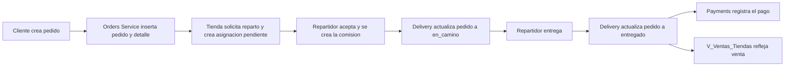

# Documentacion de Servicios - GoHenryGo

Fecha de validacion: 2026-06-15

## Resumen

UIDElivery esta organizado como una aplicacion de microservicios con una base SQL Server compartida en Amazon RDS. El acceso externo pasa por el API Gateway en `http://localhost:8000`; cada microservicio tambien expone su propio puerto para pruebas directas.

Servicios principales:

| Servicio | Tecnologia | Puerto local | Responsabilidad |
| --- | --- | ---: | --- |
| API Gateway | FastAPI | 8000 | Enrutamiento HTTP hacia microservicios |
| Users Service | FastAPI | 8001 | Usuarios, admins de plataforma y modo repartidor |
| Catalog Service | Go/Gin | 8002 | Productos, categorias, imagenes y catalogo |
| Cart Service | Go/Gin | 8003 | Carritos, items y checkout |
| Orders Service | Spring Boot | 8004 | Pedidos, detalle y cambio de estado |
| Payments Service | Spring Boot | 8005 | Pagos, metodos de pago y comisiones |
| Delivery Service | Spring Boot | 8006 | Repartidores, asignaciones y entregas |
| Auth Service | FastAPI | 8007 | Registro, login, JWT y usuario autenticado |
| Restaurant Service | FastAPI | 8008 | Tiendas, logos y personal de tienda |
| Frontend | React/Vite | 5173 | UI de clientes, tienda, plataforma y delivery |

## Ejecucion Local

Backend completo:

```powershell
docker compose --profile init run --rm database-init
docker compose up --build -d
```

La base SQL Server en RDS se recrea desde `database/init_sqlserver.py` y `database/schema_sqlserver.sql`. Los microservicios no ejecutan DDL al arrancar. El perfil `init` es destructivo y requiere acceso de red al puerto 1433 del RDS.

Frontend:

```powershell
cd frontend
npm run dev -- --host 0.0.0.0
```

URLs:

| Recurso | URL |
| --- | --- |
| Frontend | `http://localhost:5173` |
| Gateway | `http://localhost:8000` |
| Health Gateway | `http://localhost:8000/health` |

## Base de Datos

Motor y destino:

```text
Amazon RDS for SQL Server, configurado mediante RDS_HOST, RDS_PORT y RDS_DB
```

Script principal:

```text
database/schema_sqlserver.sql
```

### Vistas de Seguridad y Consulta

Las vistas agregadas centralizan consultas y reducen el acceso directo a tablas base.

| Vista | Uso |
| --- | --- |
| `V_Ordenes_Repartidor` | Lectura de asignaciones pendientes o aceptadas y datos de entrega |
| `V_Actualizar_Estado_Pedido` | Consulta del estado actual y datos principales del pedido |
| `V_Ventas_Tiendas` | Reporte de ventas por tienda, solo pedidos `entregado` |
| `V_Comisiones_Repartidores` | Resumen de comisiones por repartidor activo |
| `V_Usuarios_Permisos` | Resumen de usuarios y permisos en formato `TRUE/FALSE` |
| `V_Productos_Catalogo` | Catalogo publico, solo productos activos |
| `V_Productos_Catalogo_Tienda` | Catalogo interno de tienda, productos activos e inactivos |

### Descuentos programados

La tabla `producto` guarda:

| Campo | Uso |
| --- | --- |
| `descuento_porcentaje` | Porcentaje configurado por el administrador |
| `descuento_inicio` | Hora diaria de inicio en formato `HH:mm` |
| `descuento_fin` | Hora diaria de fin en formato `HH:mm` |

La franja es recurrente todos los dias y se evalua con la zona horaria `America/Guayaquil`. Fuera de la franja se conserva la configuracion, pero el precio se calcula sin descuento.

### Procedimientos Almacenados / USP

En el estado actual del proyecto no hay procedimientos almacenados tipo `usp_*`. La logica equivalente esta distribuida entre:

- Vistas de base de datos.
- Funciones de servicio en Python, Go y Java.

Los candidatos naturales para una futura extraccion a `usp_*` serian:

| USP sugerido | Objetivo |
| --- | --- |
| `usp_actualizar_estado_pedido` | Cambiar estado de pedido con validacion de transiciones |
| `usp_crear_pedido` | Crear pedido y detalle en una transaccion |
| `usp_asignar_repartidor` | Crear asignacion de entrega |
| `usp_calcular_comision` | Crear comision asociada a pedido entregado |
| `usp_reporte_ventas_tienda` | Consultar ventas filtradas por tienda, rango y estado |

## API Gateway

Archivo:

```text
api-gateway/main.py
```

USP / responsabilidad diferencial:

El gateway es el punto unico de entrada. Decide a que microservicio enviar cada ruta y reenvia la peticion. Las reglas de permisos viven en cada microservicio dueno del dominio.

Funciones principales:

| Funcion | Descripcion |
| --- | --- |
| `target_for` | Resuelve el microservicio destino segun la ruta |
| `proxy` | Reenvia la peticion al servicio correspondiente |

Reglas importantes aplicadas por los microservicios destino:

- Solo admins de tienda/plataforma crean productos.
- Admin o empleado de tienda puede ver pedidos de su tienda.
- Admin o empleado de tienda puede cambiar estado de pedido.
- Solo el repartidor asignado puede aceptar/cancelar/entregar una asignacion.

Rutas que enruta:

| Prefijo | Servicio destino |
| --- | --- |
| `/api/v1/auth` | Auth Service |
| `/api/v1/usuarios` | Users Service |
| `/api/v1/tiendas` | Restaurant Service o Catalog Service para `/tiendas/{id}/productos` |
| `/api/v1/productos` | Catalog Service |
| `/api/v1/categorias` | Catalog Service |
| `/api/v1/carritos` | Cart Service |
| `/api/v1/pedidos` | Orders Service y Payments Service para pago |
| `/api/v1/repartidores` | Delivery Service |
| `/api/v1/asignaciones-repartidor` | Delivery Service |

## Auth Service

Archivo:

```text
services/auth_service/app/main.py
```

USP / responsabilidad diferencial:

Administra registro, login, emision de JWT y consulta del usuario autenticado.

Endpoints principales:

| Metodo | Ruta | Descripcion |
| --- | --- | --- |
| `POST` | `/api/v1/auth/register` | Registra usuario |
| `POST` | `/api/v1/auth/login` | Login y emision de JWT |
| `GET` | `/api/v1/auth/me` | Usuario autenticado |

Funciones principales:

| Funcion | Descripcion |
| --- | --- |
| `hash_password` | Genera hash SHA-256 |
| `verify_password` | Valida contrasena |
| `create_token` | Genera JWT |
| `current_user` | Lee usuario desde token |
| `public_user` | Devuelve usuario sin datos sensibles |
| `store_memberships` | Devuelve tiendas asociadas a un usuario |

Las contrasenas se guardan hasheadas como `sha256:<digest>`, sin salt ni pepper.

## Users Service

Archivo:

```text
services/users-service/app/main.py
```

USP / responsabilidad diferencial:

Administra usuarios, admins de plataforma y modo repartidor.

Endpoints principales:

| Metodo | Ruta | Descripcion |
| --- | --- | --- |
| `GET` | `/api/v1/usuarios` | Lista usuarios, solo admin plataforma |
| `POST` | `/api/v1/admin-plataforma` | Crea/promueve admin plataforma |
| `GET` | `/api/v1/usuarios/repartidores` | Lista repartidores activos |
| `PATCH` | `/api/v1/usuarios/{id}/repartos` | Activa/desactiva modo delivery |

Funciones principales:

| Funcion | Descripcion |
| --- | --- |
| `hash_password` | Genera hash SHA-256 para admins creados desde plataforma |
| `current_user` | Lee usuario desde token |
| `public_user` | Devuelve usuario sin datos sensibles |
| `store_memberships` | Devuelve tiendas asociadas a un usuario |
| `require_platform_admin` | Exige admin plataforma |

## Restaurant Service

Archivo:

```text
services/restaurant-service/app/main.py
```

USP / responsabilidad diferencial:

Administra tiendas, enlaces de logo y personal asignado.

Endpoints principales:

| Metodo | Ruta | Descripcion |
| --- | --- | --- |
| `GET` | `/api/v1/tiendas` | Lista tiendas con disponibilidad manual y por horario |
| `POST` | `/api/v1/tiendas` | Crea tienda, solo admin plataforma |
| `PATCH` | `/api/v1/tiendas/{id}/disponibilidad` | Abre o cierra manualmente una tienda |
| `GET` | `/api/v1/tiendas/{id}/personal` | Lista personal de tienda |
| `POST` | `/api/v1/tiendas/{id}/personal` | Agrega personal |
| `DELETE` | `/api/v1/tiendas/{id}/personal/{id_tienda_usuario}` | Desactiva personal |

Funciones principales:

| Funcion | Descripcion |
| --- | --- |
| `current_user` | Lee usuario desde token |
| `require_platform_admin` | Exige admin plataforma |
| `require_store_role` | Exige rol de tienda |

La respuesta de tienda incluye `disponible` y `cerrada_por_horario`. El campo
`estado` controla el cierre manual, mientras que `disponible` combina ese valor
con el horario de atencion en `America/Guayaquil`.

## Catalog Service

Archivo:

```text
services/catalog-service/main.go
```

USP / responsabilidad diferencial:

Administra productos y categorias. Ahora separa catalogo publico e interno usando vistas:

- Publico: `V_Productos_Catalogo`, solo activos.
- Tienda: `V_Productos_Catalogo_Tienda`, activos e inactivos.

Endpoints principales:

| Metodo | Ruta | Descripcion |
| --- | --- | --- |
| `GET` | `/api/v1/productos` | Lista catalogo publico |
| `POST` | `/api/v1/productos` | Crea producto |
| `GET` | `/api/v1/productos/{id}` | Obtiene producto, incluyendo inactivo |
| `PATCH` | `/api/v1/productos/{id}` | Actualiza datos base |
| `DELETE` | `/api/v1/productos/{id}` | Desactiva producto |
| `PATCH` | `/api/v1/productos/{id}/disponibilidad` | Cambia activo/inactivo |
| `PATCH` | `/api/v1/productos/{id}/descuento` | Actualiza descuento |
| `GET` | `/api/v1/categorias` | Lista categorias |
| `POST` | `/api/v1/categorias` | Crea categoria |
| `GET` | `/api/v1/tiendas/{id}/productos` | Lista productos internos de tienda |

Los endpoints de creacion y actualizacion aceptan:

```json
{
  "imagen_url": "https://ejemplo.com/plato.jpg",
  "descuento_porcentaje": 20,
  "descuento_inicio": "14:00",
  "descuento_fin": "17:00"
}
```

Si el porcentaje es mayor que cero, ambas horas son obligatorias y `descuento_inicio` debe ser menor que `descuento_fin`. Con porcentaje cero, el servicio limpia el horario.

La respuesta de producto incluye:

| Campo | Descripcion |
| --- | --- |
| `descuento_porcentaje` | Porcentaje configurado |
| `descuento_activo` | Indica si la hora actual esta dentro de la franja |
| `descuento_aplicado` | Porcentaje efectivo; cero fuera del horario |
| `precio_final` | Precio calculado para la hora actual |

Funciones principales:

| Funcion | Descripcion |
| --- | --- |
| `productRows` | Mapea filas de vistas a JSON del API |
| `listProducts` | Lee `V_Productos_Catalogo` |
| `listProductsByStore` | Lee `V_Productos_Catalogo_Tienda` |
| `getProduct` | Obtiene un producto desde la vista de tienda |
| `createProduct` | Inserta producto en tabla base |
| `updateAvailability` | Cambia `estado` del producto |
| `normalizeDiscount` | Valida porcentaje y horario recurrente |
| `discountActive` | Evalua la franja diaria en horario de Ecuador |

Notas:

- Las vistas devuelven `estado` como `TRUE/FALSE`, pero el API lo transforma a booleano para el frontend.
- `categorias` viene concatenado desde la vista.

## Cart Service

Archivo:

```text
services/cart-service/main.go
```

USP / responsabilidad diferencial:

Administra carritos temporales y convierte un carrito en pedido llamando al Orders Service.

Endpoints principales:

| Metodo | Ruta | Descripcion |
| --- | --- | --- |
| `POST` | `/api/v1/carritos` | Crea carrito |
| `GET` | `/api/v1/carritos/{id}` | Obtiene carrito con items |
| `POST` | `/api/v1/carritos/{id}/items` | Agrega item |
| `PATCH` | `/api/v1/carritos/{id}/items/{itemId}` | Cambia cantidad |
| `DELETE` | `/api/v1/carritos/{id}/items/{itemId}` | Elimina item |
| `POST` | `/api/v1/carritos/{id}/checkout` | Crea pedido desde carrito |

Funciones principales:

| Funcion | Descripcion |
| --- | --- |
| `createCart` | Inserta carrito activo |
| `addItem` | Inserta producto al carrito con precio actual |
| `updateItem` | Actualiza cantidad/subtotal |
| `deleteItem` | Elimina item |
| `checkout` | Llama a Orders Service para crear pedido |
| `cartMap` | Construye respuesta completa del carrito |

## Orders Service

Archivo:

```text
services/orders-service/src/main/java/com/integrador/orders/OrdersApplication.java
```

USP / responsabilidad diferencial:

Crea pedidos, calcula costo de envio, valida descuentos activos y cambia estados usando `V_Actualizar_Estado_Pedido`.

Endpoints principales:

| Metodo | Ruta | Descripcion |
| --- | --- | --- |
| `GET` | `/api/v1/estados-pedido` | Lista estados |
| `GET` | `/api/v1/pedidos` | Lista pedidos, filtrable por `tienda` o `usuario` |
| `GET` | `/api/v1/pedidos/{id}` | Obtiene pedido con items y asignacion |
| `POST` | `/api/v1/pedidos` | Crea pedido con detalle |
| `PATCH` | `/api/v1/pedidos/{id}/estado` | Actualiza estado desde la vista |

Funciones principales:

| Funcion | Descripcion |
| --- | --- |
| `crearPedido` | Resuelve la ubicacion, vuelve a validar el horario del descuento, calcula totales y guarda el pedido |
| `descuentoActivo` | Evalua en `America/Guayaquil` si el porcentaje se puede cobrar |
| `actualizarEstado` | Convierte nombre de estado a id y actualiza la vista |
| `basePedidoSql` | Consulta base de pedidos con cliente, tienda y estado |
| `resolverUbicacionEntrega` | Usa una ubicacion existente o crea una nueva ubicacion de tipo `entrega` |
| `items` | Devuelve detalle del pedido |
| `asignacion` | Devuelve ultima asignacion de repartidor |

La creacion del pedido bloquea las filas de producto, valida el stock acumulado
por producto y descuenta existencias dentro de la misma transaccion. Al cancelar
un pedido pendiente o rechazarlo, las unidades se devuelven al inventario.

Reglas de envio:

| Ruta | Costo |
| --- | ---: |
| Misma zona o ubicaciones generales | `$0.50` |
| Entre zona general y Deportes o Automotriz/Gastronomia, en cualquier sentido | `$1.00` |
| Deportes hacia Automotriz/Gastronomia, o viceversa | `$1.50` |

El endpoint de cotizacion acepta tanto `id_ubicacion_entrega` como una ubicacion
nueva mediante `nombre_lugar` y `referencia`. El backend es la unica fuente del
calculo que se muestra en checkout y del valor finalmente guardado en el pedido.

Estados iniciales:

| ID | Estado |
| ---: | --- |
| 1 | `pendiente` |
| 2 | `aceptado` |
| 3 | `en_preparacion` |
| 4 | `listo_para_entrega` |
| 5 | `en_camino` |
| 6 | `entregado` |
| 7 | `cancelado` |

## Payments Service

Archivo:

```text
services/payments-service/src/main/java/com/integrador/payments/PaymentsApplication.java
```

USP / responsabilidad diferencial:

Registra pagos y comisiones asociadas a pedidos.

Endpoints principales:

| Metodo | Ruta | Descripcion |
| --- | --- | --- |
| `GET` | `/api/v1/metodos-pago` | Lista metodos activos |
| `GET` | `/api/v1/pagos` | Lista pagos |
| `GET` | `/api/v1/pedidos/{idPedido}/pago` | Obtiene pago por pedido |
| `POST` | `/api/v1/pedidos/{idPedido}/pago` | Crea o reemplaza pago |
| `GET` | `/api/v1/comisiones` | Lista comisiones |

Funciones principales:

| Funcion | Descripcion |
| --- | --- |
| `crearPago` | Registra pago; si no llega monto usa total del pedido |
| `pagoPorPedido` | Busca pago unico por pedido |

## Delivery Service

Archivo:

```text
services/delivery-service/src/main/java/com/integrador/delivery/DeliveryApplication.java
```

USP / responsabilidad diferencial:

Administra asignaciones de repartidor. La asignacion se crea pendiente y sin usuario; al aceptarla se registra el repartidor y su comision fija dentro de la misma transaccion.

Endpoints principales:

| Metodo | Ruta | Descripcion |
| --- | --- | --- |
| `GET` | `/api/v1/repartidores/disponibles` | Lista repartidores activos |
| `GET` | `/api/v1/repartidores/{id}/asignaciones` | Asignaciones de un repartidor |
| `GET` | `/api/v1/asignaciones-repartidor` | Lista asignaciones |
| `POST` | `/api/v1/asignaciones-repartidor` | Crea asignacion |
| `PATCH` | `/api/v1/asignaciones-repartidor/{id}/aceptar` | Acepta entrega y pone pedido en camino |
| `PATCH` | `/api/v1/asignaciones-repartidor/{id}/cancelar` | Cancela asignacion |
| `PATCH` | `/api/v1/asignaciones-repartidor/{id}/entregar` | Entrega y pone pedido como entregado |

Funciones principales:

| Funcion | Descripcion |
| --- | --- |
| `disponibles` | Consulta usuarios con `acepta_repartos = 1` |
| `asignacionesPorRepartidor` | Lee `V_Ordenes_Repartidor` filtrada por repartidor |
| `crearAsignacion` | Inserta asignacion en tabla base |
| `aceptar` | Marca asignacion `aceptada` y crea la comision `pendiente` |
| `cancelar` | Cancela asignacion |
| `entregar` | Marca asignacion entregada y pedido entregado |
| `actualizarPedido` | Actualiza pedido desde `V_Actualizar_Estado_Pedido` |
| `baseSql` | Consulta base desde `V_Ordenes_Repartidor` |

## Frontend

Archivo principal:

```text
frontend/src/context/AppContext.tsx
```

Responsabilidad:

La UI consume el gateway y adapta datos para las paginas de cliente, restaurante, admin plataforma y delivery.

Logica relevante:

| Funcion | Descripcion |
| --- | --- |
| `optionalProducts` | Carga catalogo publico y, si el usuario administra tiendas, mezcla productos internos activos/inactivos |
| `refreshData` | Carga tiendas y productos |
| `addMenuItem` | Crea producto con imagen por URL, porcentaje y horario recurrente opcionales |
| `toggleAvailability` | Pausa/reactiva producto |
| `checkout` | Crea pedido y asignacion de repartidor |
| `login` / `register` | Autenticacion y recarga de datos |

La pagina principal contiene una seccion `Ofertas activas`. Solo muestra productos disponibles cuyo horario de descuento esta vigente. Los datos del catalogo se actualizan cada minuto para reflejar automaticamente el inicio o fin de una oferta.

Los productos cuya unica categoria es `Extra` se ocultan del menu principal. Si
un producto tiene `Extra` y otra categoria, se muestra normalmente y tambien
puede ofrecerse como adicional.

En produccion, el Dockerfile del API Gateway construye React y sirve sus archivos
estaticos, incluyendo el fallback de rutas SPA. El frontend usa el mismo origen
para llamar a la API, por lo que funciona desde computadoras y celulares.
La instancia actual se publica en `http://100.30.192.129:8000`.

Las imagenes de tiendas y productos son enlaces `http/https` almacenados en SQL
Server. No se usan cargas de archivos, EFS ni volumenes compartidos.

## Flujo de Pedido



## Pruebas Ejecutadas

Comandos ejecutados:

```powershell
docker compose up --build -d
docker compose --profile init run --rm database-init
go test ./...
npm run build
```

Health checks:

| Puerto | Servicio | Resultado |
| ---: | --- | --- |
| 8000 | api-gateway | OK |
| 8001 | users-service | OK |
| 8002 | catalog-service | OK |
| 8003 | cart-service | OK |
| 8004 | orders-service | OK |
| 8005 | payments-service | OK |
| 8006 | delivery-service | OK |
| 8007 | auth-service | OK |
| 8008 | restaurant-service | OK |

Prueba integrada por gateway:

| Paso | Resultado |
| --- | --- |
| Login admin | OK |
| Crear tienda | OK |
| Crear categoria | OK |
| Crear producto activo | OK |
| Crear producto inactivo | OK |
| Catalogo publico solo muestra activo | OK |
| Catalogo interno de tienda muestra activo e inactivo | OK |
| Registrar cliente | OK |
| Registrar repartidor | OK |
| Crear pedido | OK |
| Cambiar estado de pedido usando vista | OK |
| Crear asignacion | OK |
| Aceptar entrega | OK |
| Entregar pedido | OK |
| Registrar pago | OK |
| Crear comision al aceptar reparto | OK |
| `V_Ventas_Tiendas` refleja venta entregada | OK |
| `V_Ordenes_Repartidor` muestra entrega | OK |

Resultado de prueba:

```json
{
  "final_order_state": "entregado",
  "public_catalog_count_for_store": 1,
  "store_catalog_count_for_store": 2,
  "ventas_view": {
    "total_pedidos": 1,
    "ingresos_totales": 7.5
  }
}
```

Prueba UI:

| Verificacion | Resultado |
| --- | --- |
| Home carga en `http://localhost:5173` | OK |
| Login admin desde UI | OK |
| Panel restaurante carga | OK |
| Tienda de prueba muestra producto activo e inactivo en panel | OK |
| Errores de consola del navegador | Ninguno |

Capturas:

```text
docs/frontend-home.png
docs/frontend-admin.png
```

## Observaciones

- Docker build compilo correctamente los servicios Java, Go y Python.
- El frontend compilo con `npm run build`.
- Vite mostro advertencias normales de React Router sobre `"use client"` ignorado en bundle; no bloquean el build.
- Gin mostro advertencias de modo debug/proxies confiados; son relevantes para produccion, no bloquean desarrollo.
- La base de desarrollo quedo con datos de prueba creados durante la validacion.
