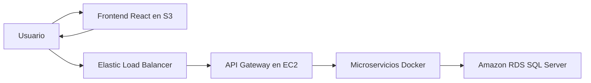

# Documentacion tecnica de GoHenryGo

Fecha de validacion: 2026-06-15

La documentacion se divide por capa:

- [Frontend](FRONTEND.md): SPA, rutas, estado, carrito, catalogo, permisos,
  errores, build y publicacion.
- [Backend](BACKEND.md): gateway, microservicios, endpoints, seguridad, stock,
  RDS, Docker y despliegue.

## Arquitectura general



El API Gateway tambien puede servir un build del frontend desde su propia
imagen. En el despliegue publico actual, el frontend se entrega desde S3 y
consume la API del ELB.

## URLs actuales

| Recurso | URL |
| --- | --- |
| Frontend publico | `http://go-henry-go.s3-website-us-east-1.amazonaws.com/` |
| API publica | `http://ELB-GoHenry-680921418.us-east-1.elb.amazonaws.com` |
| EC2 directa | `http://100.30.192.129:8000` |
| Frontend local | `http://localhost:5173` |
| Gateway local | `http://localhost:8000` |

## Decisiones vigentes

- La base es Amazon RDS for SQL Server.
- La disponibilidad de tienda combina apertura manual y horario de Ecuador.
- Orders Service valida y descuenta stock de forma transaccional.
- El carrito del navegador pertenece a una sola cuenta.
- Las ofertas usan franjas diarias recurrentes.
- Las imagenes de productos y tiendas son enlaces `http/https`.
- No se configura ni utiliza EFS.
- El perfil Docker `init` es destructivo y solo se usa para recrear la base.

## Inicio rapido

```powershell
docker compose up --build -d

cd frontend
npm ci
$env:VITE_API_URL="http://localhost:8000"
npm run dev -- --host 0.0.0.0
```

Antes de ejecutar, crear `.env` a partir de `.env.example`.
