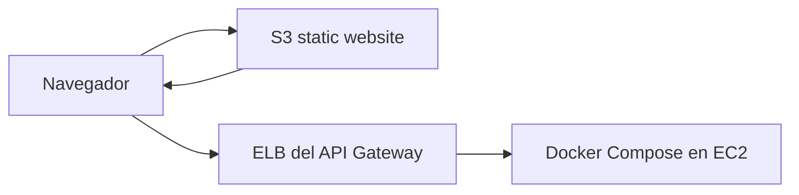

# Documentacion tecnica del frontend

Fecha de validacion: 2026-06-15

## Resumen

El frontend de GoHenryGo es una SPA desarrollada con React 19, TypeScript,
React Router 7, Vite 7 y Tailwind CSS. Consume exclusivamente el API Gateway y
ofrece interfaces para clientes, administradores de tienda, administradores de
plataforma y repartidores.

Directorio principal:

```text
frontend/
```

Puntos de entrada:

| Archivo | Responsabilidad |
| --- | --- |
| `src/main.tsx` | Montaje de React, router y proveedor global |
| `src/App.tsx` | Declaracion de rutas y proteccion por permisos |
| `src/context/AppContext.tsx` | Estado global, sesion, catalogo, carrito y pedidos |
| `src/api.ts` | Cliente HTTP y envio del JWT |
| `src/styles.css` | Estilos globales y configuracion visual |

## Ejecucion local

Requisitos:

- Node.js compatible con Vite 7.
- API Gateway accesible.

```powershell
cd frontend
npm ci
$env:VITE_API_URL="http://localhost:8000"
npm run dev -- --host 0.0.0.0
```

La aplicacion queda disponible en `http://localhost:5173`.

Comandos de validacion:

```powershell
npm run lint
npm run build
npm run preview
```

## Configuracion

La unica variable propia del frontend es:

| Variable | Uso |
| --- | --- |
| `VITE_API_URL` | URL base del API Gateway, sin `/api/v1` |

Resolucion de URL:

```ts
import.meta.env.VITE_API_URL || window.location.origin
```

Esto permite dos modalidades:

1. Frontend separado: S3 usa `VITE_API_URL` apuntando al balanceador.
2. Frontend servido por el gateway: usa el mismo origen.

Ejemplo para el sitio S3 actual:

```powershell
$env:VITE_API_URL="http://ELB-GoHenry-680921418.us-east-1.elb.amazonaws.com"
npm run build
```

No se deben guardar credenciales AWS ni secretos del backend en variables
`VITE_*`, porque Vite las incorpora al JavaScript publico.

## Rutas

| Ruta | Pagina | Acceso |
| --- | --- | --- |
| `/` | Inicio, ofertas, restaurantes y productos | Publico |
| `/index` | Alias del inicio | Publico |
| `/restaurant/:id` | Menu de una tienda | Publico |
| `/restaurante/:id` | Alias del menu de tienda | Publico |
| `/detalle/:restaurantId/:productId` | Detalle de producto | Publico |
| `/login` | Inicio de sesion | Publico |
| `/register` | Registro | Publico |
| `/checkout` | Carrito y checkout | Usuario autenticado |
| `/carrito` | Alias del checkout | Usuario autenticado |
| `/pedido` | Seguimiento del pedido activo | Usuario autenticado |
| `/usuario` | Perfil e historial | Usuario autenticado |
| `/platform-admin` | Administracion de plataforma | Admin de plataforma |
| `/restaurant-admin` | Administracion de tienda | Admin de plataforma o personal de tienda |
| `/delivery` | Asignaciones de reparto | Admin de plataforma o repartidor activo |

Las rutas desconocidas redirigen a `/`. `ProtectedRoute` espera a que termine la
carga de permisos, redirige a `/login` cuando no hay sesion y vuelve al inicio
cuando el usuario no tiene el rol requerido.

## Estado global

`AppProvider` centraliza:

- Tiendas y productos.
- Categorias.
- Usuario autenticado y permisos.
- Carrito.
- Pedido activo.
- Errores de carga y carrito.
- Operaciones administrativas.

### Carga y sincronizacion

`refreshData` solicita:

```text
GET /api/v1/tiendas
GET /api/v1/productos
GET /api/v1/categorias
```

Para usuarios que administran tiendas tambien solicita:

```text
GET /api/v1/tiendas/{id}/productos
```

Ese catalogo interno incluye productos activos e inactivos. Los resultados se
mezclan por `id_producto`, dando prioridad a la respuesta interna.

Los datos se actualizan:

- Al iniciar la aplicacion.
- Despues de mutaciones de tienda o producto.
- Cada 60 segundos.
- Cuando la ventana recupera el foco.
- Cuando la pagina vuelve a estar visible.

Esto evita depender de una recarga manual para ver cambios de stock, horario,
descuentos o productos.

## Sesion y permisos

El cliente HTTP agrega el encabezado:

```http
Authorization: Bearer <token>
```

El usuario se vuelve a validar con `GET /api/v1/auth/me` al iniciar la SPA.

Permisos derivados:

| Permiso | Regla |
| --- | --- |
| `canCreateStores` | `rol_usuario === "admin_plataforma"` |
| `canManageStore` | Admin de plataforma o miembro de al menos una tienda |
| `canUseDelivery` | Admin de plataforma o `acepta_repartos === true` |
| `managedRestaurants` | Todas las tiendas para plataforma; solo membresias para personal |

La seleccion de tienda en el panel usa `id_tienda`; cada accion administrativa
se ejecuta sobre la tienda seleccionada, no sobre la primera tienda cargada.

## Persistencia local

| Clave | Contenido |
| --- | --- |
| `token` | JWT de sesion |
| `usuario` | Usuario publico y membresias |
| `cart` | Items del carrito actual |
| `cartOwnerId` | Propietario del carrito |
| `lastOrder` | Ultimo pedido activo |
| `dismissedOrders` | Pedidos rechazados ocultados por el usuario |

El carrito esta ligado a `cartOwnerId`. Al iniciar sesion, registrar otro
usuario, cerrar sesion o detectar un propietario distinto, el carrito anterior
se elimina. Esto impide compartir productos entre cuentas en el mismo navegador.

## Tiendas y horarios

La API entrega:

| Campo | Significado |
| --- | --- |
| `estado` | Apertura o cierre manual |
| `disponible` | `estado` y hora dentro del horario |
| `cerrada_por_horario` | Cierre automatico con apertura manual activa |
| `horario_apertura` | Inicio diario `HH:mm` |
| `horario_cierre` | Fin diario `HH:mm` |

El frontend utiliza `disponible` como fuente principal. Para compatibilidad con
una API antigua que no incluya ese campo, `storeIsWithinSchedule` calcula la
disponibilidad en la zona `America/Guayaquil`.

El boton de administracion alterna el cierre manual mediante:

```text
PATCH /api/v1/tiendas/{id}/disponibilidad
```

El texto del boton depende de `manuallyOpen`, mientras que el estado visible al
cliente depende de `available`. Por eso una tienda puede estar manualmente
habilitada y aparecer cerrada automaticamente fuera de su horario.

## Productos, categorias y ofertas

Cada producto adaptado por el contexto contiene:

- Precio original y precio final.
- Stock.
- Estado administrativo.
- Disponibilidad efectiva.
- Categorias e identificadores de categoria.
- Descuento configurado y descuento activo.
- URL de imagen.

Reglas de menu:

- Un producto cuya unica categoria sea `Extra` no aparece como plato principal.
- Un producto con `Extra` y otra categoria si aparece en el menu.
- Los productos con categoria `Extra` pueden ofrecerse como adicionales.
- Un producto sin stock o inactivo no puede agregarse al carrito.

La seccion `Ofertas activas` aparece antes de `Restaurantes` y muestra productos
con `descuento_activo`. Una tienda cerrada puede conservar una oferta visible,
pero la compra se bloquea hasta que vuelva a estar disponible.

Las imagenes son enlaces `http/https`. `productImageUrl` y `storeLogoUrl`
rechazan valores que no comiencen con `http`; en ese caso se usa una imagen
generica. No hay selector de archivos ni dependencia de EFS.

## Carrito y stock

Validaciones en la UI:

- Solo se mantienen productos de una tienda a la vez.
- No se agrega un producto si la tienda esta cerrada.
- No se agrega un producto sin stock.
- La cantidad no puede superar el stock conocido.
- En cada actualizacion del catalogo, la cantidad se limita al stock nuevo.

Estas validaciones mejoran la experiencia, pero no sustituyen la validacion
transaccional del Orders Service. El backend vuelve a comprobar stock y
disponibilidad al crear el pedido.

## Checkout

Flujo:

1. Cargar ubicaciones y metodos de pago.
2. Cotizar envio con `POST /api/v1/pedidos/cotizar-envio`.
3. Crear el pedido con `POST /api/v1/pedidos`.
4. Registrar el pago con `POST /api/v1/pedidos/{id}/pago`.
5. Consultar el pedido actualizado.
6. Vaciar el carrito y refrescar el catalogo.

Payload simplificado:

```json
{
  "id_usuario": 10,
  "id_tienda": 7,
  "tipo_pedido": "delivery",
  "id_ubicacion_entrega": 5,
  "items": [
    {
      "id_producto": 3,
      "cantidad": 2
    }
  ]
}
```

Los conflictos de stock, tienda cerrada o fuera de horario se muestran al
cliente. Los detalles internos de red o API se sustituyen por mensajes
genericos mediante `customerErrorMessage`.

## Administracion

### Plataforma

- Crear, editar y eliminar tiendas.
- Crear categorias.
- Crear administradores de plataforma.
- Entrar a la administracion de una tienda concreta.

### Tienda

- Abrir o cerrar manualmente.
- Editar informacion, ubicacion, horario y logo.
- Crear, editar, activar, desactivar y eliminar productos.
- Editar stock, categorias, imagen, precio y descuento.
- Administrar personal.
- Consultar pedidos y cambiar su estado.

### Repartidor

- Consultar asignaciones disponibles y propias.
- Aceptar o cancelar una asignacion.
- Marcar pedido en camino.
- Marcar entrega completada.

## Errores para clientes

`src/api.ts` transforma fallos de conexion en:

```text
No pudimos conectarnos en este momento. Intenta nuevamente en unos segundos.
```

Las pantallas no deben exponer nombres de tablas, servicios, respuestas crudas
ni mensajes como "Error de API". Solo se conservan detalles accionables para el
cliente, por ejemplo stock insuficiente o tienda cerrada.

## Build y despliegue

### Sitio estatico en S3

Arquitectura publica actual:



URL publica:

```text
http://go-henry-go.s3-website-us-east-1.amazonaws.com/
```

El build de S3 debe definir `VITE_API_URL` con el ELB. La carga a S3 requiere
credenciales AWS con `s3:PutObject` para el bucket.

### Frontend servido por el gateway

`api-gateway/Dockerfile` usa una etapa Node para ejecutar `npm run build` y
copia `dist` a `/app/frontend`. El gateway sirve archivos estaticos y devuelve
`index.html` para rutas SPA desconocidas.

Esta modalidad usa el mismo host para frontend y API. Es una alternativa al
sitio S3, no un requisito adicional.

## Diagnostico

| Sintoma | Revision |
| --- | --- |
| La SPA no carga datos | Comprobar `VITE_API_URL`, ELB y `/health` |
| Todas las tiendas aparecen cerradas | Revisar `disponible`, horario y zona `America/Guayaquil` |
| Los cambios aparecen al recargar | Revisar `refreshData`, consola y peticiones bloqueadas |
| El carrito cambia de usuario | Revisar `cartOwnerId` y flujo de login/logout |
| Una imagen no aparece | Confirmar URL publica `http/https` y CORS del host de imagen |
| Una ruta S3 devuelve 404 | Configurar documento de error/fallback a `index.html` |

